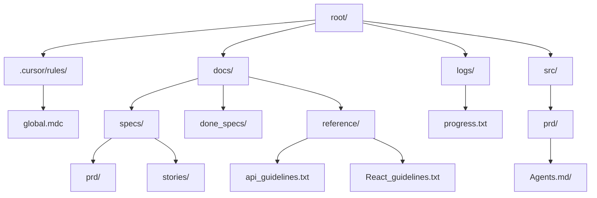
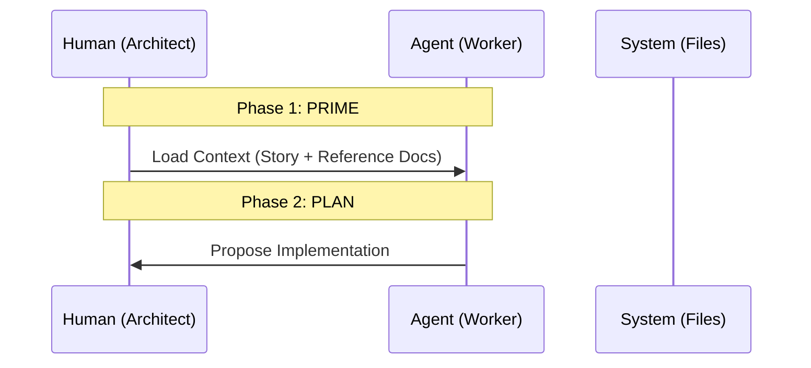

# Strata Dev Framework The compounding AI Playbook

**Status:** 🟢 Active | **Version:** 2.0 | **Guardian:** Engineering Lead

<aside>
💡

**Mission:** *We do not just ship code; we architect the system that ships the code.*

</aside>

## 👋 Introduction

Welcome to the **Strata Dev Framework**, a revolutionary approach to AI-assisted software development that transforms linear "vibe coding" into a **compounding engineering system**.

This framework is built on a simple but powerful insight: *traditional AI coding relies on chat history (RAM), which decays over time. Instead, we move intelligence to the file system (Disk), creating a system that gets smarter with every bug fixed.*

### 🎯 What You'll Find Here

This page is your **implementation guide** for applying the Strata Dev Framework to your daily development workflow. It covers:

- **The Philosophy:** Why traditional AI coding fails and how Strata fixes it
- **The Architecture:** How to structure your codebase as a "Disk-Based Brain"
- **The Process:** The PPRE Cycle for deterministic, autonomous execution
- **The Standards:** Documentation rules that create compound learning
- **The Templates:** Ready-to-use artifacts to get started immediately

### 📚 Companion Resources

For deep dives into the theory, architecture, and philosophy behind this framework, visit the [Documentation Folder](Documentation%20Folder%202eaacc211ff1801b82b1f4c2f2d9b8ff.md), which contains:

- **Framework Overview** (start here for first-time readers)
- **The Complete Developer Handbook** (comprehensive technical reference)
- **[Core Technical Specification](Core%20Technical%20Specification%2061087d4cd5cd48d2a9a58048d24689d7.md)** (directory structure, workflows, implementation guide)
- **PPRE Cycle Guide** (detailed process documentation)
- **Architecture Videos** (visual explanations)
- **Podcasts** (context on "The Hidden Cost of Human Middleware")
- **[Learning Resources & References](Learning%20Resources%20&%20References%2059c24ed933d449a8ab26223067c280df.md)** (external tools, GitHub repos, video tutorials)

<aside>
📖

**New to the framework?** Start with the [Documentation Folder](Documentation%20Folder%202eaacc211ff1801b82b1f4c2f2d9b8ff.md), read the Framework Overview PDF, then return here for implementation guidance.

</aside>

### 📑 Table of Contents

1. The Manifesto: From Linear to Exponential
2. System Architecture: The Disk-Based Brain
3. The Engine: PPRE & The Kill Switch
4. The Ralph Protocol: Atomic Execution
5. System Evolution: The Golden Rule
6. Templates & Artifacts
7. Documentation Standards

---

# 🧬 The Manifesto: From Linear to Exponential

<aside>
📄

**Deep dive:** For a comprehensive exploration of this philosophy, see the Framework Overview in [Documentation Folder](Documentation%20Folder%202eaacc211ff1801b82b1f4c2f2d9b8ff.md).

</aside>

### The Problem: "Vibe Coding"

Traditional AI coding is **Linear**. You chat, you get code, you paste it.

- ❌ **Context Decay:** As the chat gets longer, the AI's IQ drops.
- ❌ **Zero Memory:** Fixing a bug in the chat fixes it *once*. It does not teach the system for the next time.
- ❌ **Fragility:** Without specs, the code drifts from the requirements instantly.

### The Solution: Compounding Engineering

Under **Strata Dev Framework The Compounding AI Playbook**, every bug fixed must leave the system smarter than it was yesterday. We achieve this by moving intelligence from **RAM (Chat)** to **Disk (Files)**.

<aside>
💡

**The Core Equation:**

`Bug Found` + `Update` [`agents.md`](http://agents.md) = `Asset Appreciation`

</aside>

---

# 🧠 System Architecture: The Disk-Based Brain

<aside>
🎬

**Visual learners:** Watch the Architecture Videos in [Documentation Folder](Documentation%20Folder%202eaacc211ff1801b82b1f4c2f2d9b8ff.md) for detailed walkthroughs of this system.

</aside>

<aside>
⚙️

**Implementation reference:** See [Core Technical Specification](Core%20Technical%20Specification%2061087d4cd5cd48d2a9a58048d24689d7.md) for the complete directory structure and component roles.

</aside>

We treat the file system as the brain of the AI. Do not rely on the chat history.

### 📂 Directory Topology

### 🧩 Component Breakdown



#### 🏛️ 1. The Constitution (`.cursor/rules/global.mdc`)

- **Purpose:** The immutable laws. Tech stack, forbidden patterns, and safety rails.
- **Constraint:** Must be **< 200 lines**. If it's too long, the AI ignores it.
- **Content:** "Always use TypeScript", "No console.logs", "Follow PPRE cycle".

#### 📚 2. Modular Context (`docs/reference/*.md`)

- **Purpose:** **Context Sharding**. We do not load all documentation at once.
- **Mechanism:** If the agent is working on Auth, it loads [`auth.md`](http://auth.md). It does *not* load [`billing.md`](http://billing.md). This prevents **Context Poisoning**.

#### 🦠 3. Fractal Memory (`src/**/[agents.md](http://agents.md)`)

- **Purpose:** **Tacit Knowledge**. This is where the system "learns".
- **Location:** Lives inside every folder (e.g., `src/components/`[`agents.md`](http://agents.md)).
- **Content:** "In this folder, we use named exports only." "Button.tsx has a known issue with z-index."

#### 📜 4. The Input Contract (`docs/specs/stories.json`)

- **Purpose:** The executable instruction.
- **Format:** JSON array of atomic tasks with **Binary Acceptance Criteria** (Pass/Fail).

---

# ⚙️ The Engine: PPRE & The Kill Switch

<aside>
📄

**Process details:** For a complete breakdown of each phase, see The_PPRE_Cycle.pdf in [Documentation Folder](Documentation%20Folder%202eaacc211ff1801b82b1f4c2f2d9b8ff.md).

</aside>

We do not "chat" with code. We execute the **PPRE Cycle**.

### 🔄 The Cycle Visualization



### 🛑 The Kill Switch (Context Reset)

<aside>
⚠️

*"Context Rot is the enemy of intelligence."*

</aside>

You must **wipe the chat history** (reset) between the Plan and Execute phases.

1. **Plan Phase:** High creativity, lots of tokens.
2. **Reset:** Restore IQ to 100%.
3. **Execute Phase:** High precision, zero noise. Feed *only* the Plan and the active file.

---

# 🤖 The Ralph Protocol: Atomic Execution

<aside>
📖

**Implementation guide:** See the Developer Handbook in [Documentation Folder](Documentation%20Folder%202eaacc211ff1801b82b1f4c2f2d9b8ff.md) for advanced examples and edge cases.

</aside>

How to write `stories.json` so the agent cannot fail.

### 📏 Rule of Atomicity

A story is **Atomic** if it can be completed in **ONE** context window (approx. 1 file or 1 function). If it requires "figuring things out", it is not a story; it is research.

### ✅ Binary Acceptance Criteria

Criteria must be objectively **True** or **False**. No subjectivity allowed.

| ❌ **Bad Criteria (Vague)** | ✅ **Good Criteria (Binary)** |
| --- | --- |
| "Make the UI look modern" | "Button uses Tailwind class `rounded-lg`" |
| "Fix the bug" | "Function `calculateTotal` returns 100 for input" |
| "Add error handling" | "API returns 400 status on invalid JSON" |

### 🛡️ Self-Verification

The Agent must read `stories.json`, check its own code against the `acceptance_criteria`, and *only then* mark `passes: true`. Humans verify *after* the agent claims success.

---

# 📈 System Evolution: The Golden Rule

This is the most important section for the "Guardian" role.

### 🧬 The Evolution Loop

When a bug occurs or the Agent gets stuck:

1. **Fix the Code:** (Linear work).
2. **Codify the Lesson:** (Exponential work). You **MUST** update a Markdown file.
- **Logic Error?** → Update `src/\*/`[`agents.md`](http://agents.md) ("Warning: This API returns strings, not numbers").
- **Style Error?** → Update `.cursor/rules/global.mdc`.
- **Process Error?** → Update `docs/reference/`[`workflow.md`](http://workflow.md).

<aside>
⚠️

**Mandate:** If you fix a bug manually and do not update a `.md` file, you have failed the protocol. The system has not learned.

</aside>

---

# 📝 Templates & Artifacts

### 📄 `docs/specs/stories.json` Template

```json
{
  "epic": "User Authentication",
  "stories": [
    {
      "id": "AUTH-01",
      "description": "Create Login Form Component",
      "files_to_touch": ["src/components/LoginForm.tsx"],
      "acceptance_criteria": [
        "Component exports 'LoginForm'",
        "Contains email and password input fields",
        "Submit button is disabled when fields are empty"
      ],
      "passes": false
    }
  ]
}
```

### 📄 `src/components/`[`agents.md`](http://agents.md) Template (Memory)

```markdown
# 🧠 Agent Memory: Components Folder

## 📌 Critical Lessons
- **2023-10-25:** We use `shadcn/ui` for all buttons. Do not import raw HTML buttons.
- **2023-11-02:** All forms must use `react-hook-form` with `zod` validation.

## 🛑 Known Issues
- The `DatePicker` component crashes if passed a null date. Always wrap in a conditional check.
```

### 📄 `.cursor/rules/global.mdc` Header

```markdown
---
description: GLOBAL CONSTITUTION - ALWAYS ACTIVE
globs: *
---
# 🏗️ Strata Dev Framework Constitution

YOU MUST FOLLOW THE ARCHITECTURE AND WORKFLOWS DEFINED IN `docs/strata_
```

<aside>
📄

**Full specification:** For the complete directory structure and workflow details, see [Core Technical Specification](Core%20Technical%20Specification%2061087d4cd5cd48d2a9a58048d24689d7.md).

</aside>

---

<aside>
🚀

### How to Launch This Framework

1. Share this page with your engineering team
2. Establish the rule: **nobody writes code until they have read this**
3. Create the directory structure in your repository
4. Begin with a small pilot project to validate the workflow
5. Update [`agents.md`](http://agents.md) files as you learn

---

</aside>

# 📚 Documentation Standards

<aside>
📚

**Reference materials:** All constitutional documents and templates are available in [Documentation Folder](Documentation%20Folder%202eaacc211ff1801b82b1f4c2f2d9b8ff.md).

</aside>

Documentation is not an afterthought. It is the **permanent memory** of the system.

### 🎯 The Documentation Hierarchy

#### Level 1: Constitutional (`.cursor/rules/global.mdc`)

**When to update:** When you establish a new universal rule or architectural constraint.

**Examples:**

- "Database migrations must be reversible"
- "All API calls must use the centralized `apiClient` wrapper"
- "All components must be tested with React Testing Library"

**Lifespan:** Permanent until a major architecture change.

#### Level 2: Reference (`docs/reference/*.md`)

**When to update:** When you add new features, APIs, or integration patterns.

**Required files:**

- `api_`[`endpoints.md`](http://endpoints.md) - All backend endpoints with request/response examples
- [`auth.md`](http://auth.md) - Authentication flow, token management, permissions
- `db_`[`schema.md`](http://schema.md) - Database tables, relationships, indexes
- [`deployment.md`](http://deployment.md) - Build, test, and deployment procedures
- `env_`[`variables.md`](http://variables.md) - All environment variables and their purpose

**Format:**

```markdown
# API Endpoints

## POST /api/users/login

**Purpose:** Authenticate user and return JWT token

**Request:**
{
  "email": "[user@example.com](mailto:user@example.com)",
  "password": "hashed_password"
}

**Response (200):**

{
  "token": "eyJhbGc...",
  "user": { "id": 123, "name": "John" }
}

**Error Cases:**
- 401: Invalid credentials
- 429: Rate limit exceeded
```

#### Level 3: Tactical (`src/*/`[`agents.md`](http://agents.md))

**When to update:** Every time you fix a bug, discover a gotcha, or establish a local convention.

**Structure:**

```markdown
# 🧠 Agent Memory: [Folder Name]

## 📌 Critical Lessons
- **YYYY-MM-DD:** Lesson learned with context

## 🛑 Known Issues
- Issue description and workaround

## 🏗️ Local Conventions
- "This folder uses X pattern because Y"

## 🔗 Dependencies
- "Module A depends on Module B for Z functionality"
```

#### Level 4: Execution (`logs/progress.txt`)

**When to update:** After completing each story in `stories.json`.

**Format:**

```jsx
[2026-01-16 15:30] ✅ AUTH-01: Login Form Component
- Created LoginForm.tsx with email/password fields
- Added form validation with react-hook-form
- All acceptance criteria passed
- Updated src/components/
```

### 📐 Documentation Rules

<aside>
⚡

**Rule 1: No Orphan Fixes**
Every bug fix MUST update at least one `.md` file. If you fix it in code but not in docs, you will hit the same bug again.

</aside>

<aside>
⚡

**Rule 2: Date Every Entry**
Always prefix lessons with `YYYY-MM-DD`. This creates a timeline of system evolution.

</aside>

<aside>
⚡

**Rule 3: Be Specific**
"The API is weird" ❌
"The `/users` endpoint returns strings for IDs, not numbers" ✅

</aside>

<aside>
⚡

**Rule 4: One Source of Truth**
Do not duplicate information. Use references:
"For authentication, see `docs/reference/`[`auth.md`](http://auth.md)"

</aside>

<aside>
⚡

**Rule 5: Archive Completed Specs**
When a feature is complete, move `docs/specs/feature.json` to `docs/done_specs/feature.json`. Keep the active folder clean.

</aside>

### 🔍 Documentation Checklist

Before marking any story as complete, verify:

- [ ]  Code is written and passes acceptance criteria
- [ ]  Relevant [`agents.md`](http://agents.md) file updated with lessons learned
- [ ]  Reference docs updated if new APIs/patterns were introduced (see [Documentation Folder](Documentation%20Folder%202eaacc211ff1801b82b1f4c2f2d9b8ff.md) for constitutional and reference templates)
- [ ]  `logs/progress.txt` entry created with timestamp
- [ ]  Story in `stories.json` marked as `"passes": true`
- [ ]  Spec moved to `done_specs/` if entire epic is complete
- [ ]  Framework documentation in [Documentation Folder](Documentation%20Folder%202eaacc211ff1801b82b1f4c2f2d9b8ff.md) consulted if architectural decisions were made

### 💡 Pro Tips

**For Code Reviews:**

- Before approving a PR, check if documentation was updated
- Ask: "What would the next developer need to know?"

**For Onboarding:**

- New team members should read in this order:
    1. [Documentation Folder](Documentation%20Folder%202eaacc211ff1801b82b1f4c2f2d9b8ff.md) (Start with Framework Overview and Developer Handbook)
    2. `global.mdc` (The laws)
    3. This page (The framework implementation guide)
    4. `docs/reference/` (The current system)
    5. `src/\*/`[`agents.md`](http://agents.md) (The gotchas)

**For Debugging:**

- Search [`agents.md`](http://agents.md) files first before Googling
- The solution might already be documented from last time

<aside>
🎓

**Remember:** Documentation is not overhead. It is **compound interest** on your engineering investment. Every minute spent documenting saves hours in the future.

</aside>

---

# 🎓 Certification: Prove Your Mastery

<aside>
⚠️

**🚨 MANDATORY REQUIREMENT 🚨**

Before you are authorized to write code using this framework, you **MUST** complete and pass the official certification quiz.

**Passing Score:** 90% (Maximum 1 error allowed)

**What it covers:**

- The Mindset Protocols (understanding "Vibe Coding" vs. Compounding Engineering)
- System Architecture (Memory Architecture, Context Sharding)
- The PPRE Execution Loop (Prime → Plan → Reset → Execute)
- Guardian Scenarios (real-world decision-making)
- Protocol Compliance (Acceptance Criteria, Evolution Loop)
</aside>

### 📋 Assessment Details

This is the **Official Competency Assessment** for the Strata Dev Framework. It consists of 15 questions covering:

- **Section 1:** The Mindset Protocols (True/False)
- **Section 2:** System Architecture (Select All That Apply)
- **Section 3:** The PPRE Execution Loop
- **Section 4:** The Guardian Scenarios
- **Section 5:** Final Protocol Check

### ✅ Certification Requirements

1. **Complete the reading journey:**
    - Review all materials in [Documentation Folder](Documentation%20Folder%202eaacc211ff1801b82b1f4c2f2d9b8ff.md)
    - Read this implementation guide completely
    - Watch all architecture videos
    - Listen to the framework podcasts
    - Review [Learning Resources & References](Learning%20Resources%20&%20References%2059c24ed933d449a8ab26223067c280df.md) for external tools and tutorials
2. **Take the certification quiz:**
    - [**📝 Access the Official Certification Quiz**](https://forms.gle/ABvRg4qtwXCZZdqB7)
    - You must score at least 90% (14/15 correct)
    - Maximum 1 error allowed
3. **Apply the framework:**
    - Only after passing can you begin coding with this framework
    - Your certification demonstrates you understand the Guardian role
    - You are now responsible for maintaining System Evolution

<aside>
🏆

### Ready to Certify?

Once you've completed your study of all framework materials, take the quiz:

**👉** [****START CERTIFICATION QUIZ****](https://forms.gle/ABvRg4qtwXCZZdqB7)

Remember: This is not a test of memorization, but of understanding. The framework depends on Guardians who truly grasp the philosophy of compounding engineering.

</aside>

---

[Documentation Folder](Documentation%20Folder%202eaacc211ff1801b82b1f4c2f2d9b8ff.md)