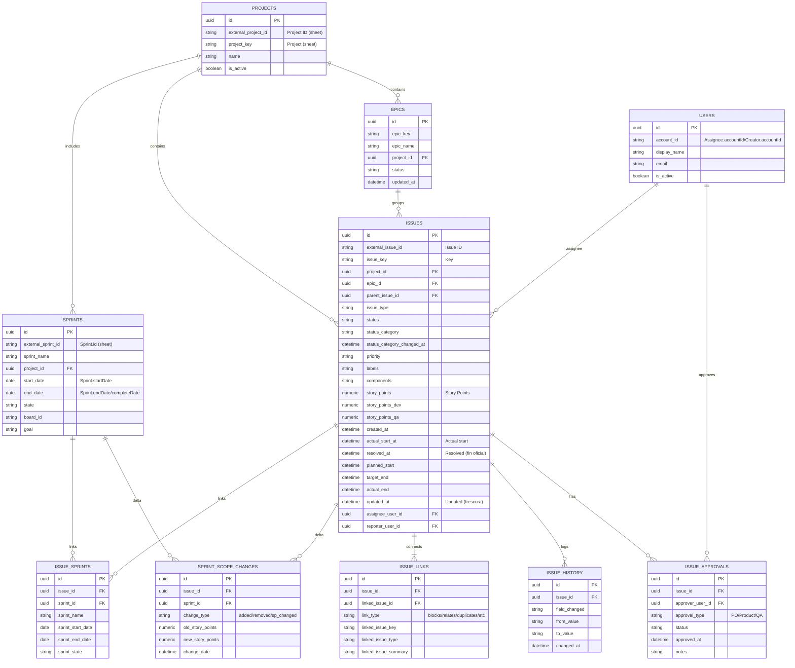

# 📋 REQUERIMIENTOS COMPLETOS - DELIVERY DASHBOARD
## Documento Base para Creación de PRD Nuevo

**Versión:** 1.0  
**Fecha:** 2026-01-23  
**Propósito:** Documento extenso con todos los requerimientos funcionales y técnicos del Delivery Dashboard, organizados por módulos y cronología de implementación realista.

---

## 📑 TABLA DE CONTENIDOS

1. [Visión General del Proyecto](#visión-general-del-proyecto)
2. [Arquitectura Técnica](#arquitectura-técnica)
3. [Módulo 1: Infraestructura Base](#módulo-1-infraestructura-base)
4. [Módulo 2: Autenticación y Autorización](#módulo-2-autenticación-y-autorización)
5. [Módulo 3: Sincronización de Datos](#módulo-3-sincronización-de-datos)
6. [Módulo 4: Overall View Dashboard](#módulo-4-overall-view-dashboard)
7. [Módulo 5: Delivery Metrics](#módulo-5-delivery-metrics)
8. [Módulo 6: Projects Metrics](#módulo-6-projects-metrics)
9. [Módulo 7: Developer Metrics](#módulo-7-developer-metrics)
10. [Módulo 8: Team Capacity](#módulo-8-team-capacity)
11. [Módulo 9: Product Roadmap](#módulo-9-product-roadmap)
12. [Módulo 10: Delivery Roadmap](#módulo-10-delivery-roadmap)
13. [Módulo 11: KPIs Dashboard](#módulo-11-kpis-dashboard)
14. [Módulo 12: ENPS Survey System](#módulo-12-enps-survey-system)
15. [Módulo 13: Administración](#módulo-13-administración)
16. [Módulo 14: Reporting y Exportación](#módulo-14-reporting-y-exportación)
17. [Cronología de Implementación](#cronología-de-implementación)
18. [Criterios de Aceptación Globales](#criterios-de-aceptación-globales)

---

## 🎯 VISIÓN GENERAL DEL PROYECTO

### Objetivo Principal
Dashboard React para visualizar métricas de delivery en tiempo real, sincronizado automáticamente desde Jira Cloud for Sheets (Google Sheets) a Supabase. El objetivo es que los usuarios abran el dashboard y vean la data actualizada automáticamente, sin ejecutar nada manualmente.

### Usuarios Objetivo
1. **Product Managers (PMs)** - Visualizar métricas de proyectos y sprints
2. **Engineering Managers** - Monitorear capacidad del equipo y carga de trabajo
3. **Developers** - Ver métricas individuales de performance
4. **Stakeholders** - Vista general de KPIs de delivery
5. **3 Amigos** (PM, Tech Lead, Product Owner) - Gestión colaborativa de métricas
6. **Administradores** - Gestión de usuarios y permisos

### Principios de Diseño
- **Automatización Total:** Sin intervención manual para actualizar datos
- **Tiempo Real:** Datos actualizados cada 30 minutos automáticamente
- **Multi-tenant:** Soporte para múltiples proyectos Jira vía Jira Cloud for Sheets (múltiples sheets/pestañas o ranges)
- **Escalable:** Arquitectura que soporta crecimiento futuro
- **Seguro:** Autenticación y autorización robusta
- **Performante:** Carga rápida y visualización fluida

### Estrategia de Pruebas (E2E + Historias)
- Cada historia en `docs/specs/stories.json` debe incluir escenarios de prueba (positivos y negativos) y un plan e2e que cubra los `acceptance_criteria` de forma binaria.
- La suite e2e debe mapear uno-a-uno los `acceptance_criteria` activos, incluyendo casos de error / “lo que no debe ocurrir”.
- No se permite commit/push hasta que la suite e2e relevante a la historia haya sido ejecutada y pasada.
- El diseño de stories (durante la construcción/actualización del JSON) debe detallar los test scenarios y el plan de ejecución e2e asociado a cada criterio.

---

## 🏗️ ARQUITECTURA TÉCNICA

### Stack Tecnológico

#### Frontend
- **Framework:** React 18.2+
- **Build Tool:** Vite 5.1+
- **Styling:** TailwindCSS 3.x
- **Charts:** Recharts 2.12+
- **Icons:** Lucide React
- **PDF Generation:** jsPDF + html2canvas
- **State Management:** React Hooks (useState, useEffect, useContext)
- **Routing:** React Router (si aplica) o estado local
- **HTTP Client:** Fetch API nativo

#### Backend/Database
- **Database:** Supabase (PostgreSQL 14+)
- **Auth:** Supabase Auth
- **API:** Supabase REST API + RPC Functions
- **Storage:** Supabase Storage (si aplica)

#### Sync Service
- **Runtime:** Node.js 18+
- **HTTP Client:** node-fetch o axios
- **Scheduler:** Cron jobs (Vercel Cron, GitHub Actions, o servicio dedicado)
- **Logging:** Console logging estructurado

#### Deployment
- **Frontend:** GitHub Pages o Vercel
- **Sync Service:** Vercel, Railway, Render, o servicio dedicado
- **Database:** Supabase Cloud

### Flujo de Datos

```
┌─────────────────────┐
│ Jira Cloud for Sheets│
│    (Google Sheets)   │
└──────┬──────────────┘
       │
       │ (cada 30 min)
       ▼
┌─────────────────────┐
│ sheets-supabase-sync│
│   (Node.js Service) │
└──────┬──────────────┘
       │
       │ (upsert/insert)
       ▼
┌─────────────────────┐
│   Supabase (PG)     │
│  - sprints           │
│  - issues            │
│  - developers        │
│  - squads/projects   │
│  - issue_history     │
│  - issue_sprints     │
└──────┬──────────────┘
       │
       │ (queries/RPC)
       ▼
┌─────────────────────┐
│  React Dashboard    │
│  (Frontend)         │
└─────────────────────┘
```

### Estructura de Base de Datos (Principales Tablas)

#### Diagrama ER (Mermaid) - Cobertura completa (sync, métricas, reportes)


#### Tablas Core

##### `squads` - Equipos/Squads de Desarrollo
```sql
CREATE TABLE squads (
    id UUID PRIMARY KEY DEFAULT gen_random_uuid(),
    name VARCHAR(255) NOT NULL UNIQUE,
    display_name VARCHAR(255),
    project_key VARCHAR(50),
    is_active BOOLEAN DEFAULT true,
    created_at TIMESTAMP WITH TIME ZONE DEFAULT NOW(),
    updated_at TIMESTAMP WITH TIME ZONE DEFAULT NOW()
);

-- Índices
CREATE INDEX idx_squads_project_key ON squads(project_key);
CREATE INDEX idx_squads_is_active ON squads(is_active);
```

**Campos:**
- `id` - UUID único del squad
- `name` - Nombre único del squad (ej: "Core Infrastructure")
- `display_name` - Nombre para mostrar (opcional)
- `project_key` - Key del proyecto Jira asociado (ej: "OBD")
- `is_active` - Si el squad está activo
- `created_at`, `updated_at` - Timestamps de auditoría

**Casos de Uso:**
- Listar todos los squads activos para filtros
- Agrupar métricas por squad
- Validar que un sprint pertenece a un squad válido

##### `developers` - Desarrolladores
```sql
CREATE TABLE developers (
    id UUID PRIMARY KEY DEFAULT gen_random_uuid(),
    jira_account_id VARCHAR(255) UNIQUE,
    email VARCHAR(255),
    display_name VARCHAR(255) NOT NULL,
    avatar_url TEXT,
    squad_id UUID REFERENCES squads(id),
    is_active BOOLEAN DEFAULT true,
    created_at TIMESTAMP WITH TIME ZONE DEFAULT NOW(),
    updated_at TIMESTAMP WITH TIME ZONE DEFAULT NOW()
);

-- Índices
CREATE INDEX idx_developers_jira_account_id ON developers(jira_account_id);
CREATE INDEX idx_developers_squad_id ON developers(squad_id);
CREATE INDEX idx_developers_is_active ON developers(is_active);
```

**Campos:**
- `id` - UUID único del desarrollador
- `jira_account_id` - ID de cuenta de Jira (único)
- `email` - Email del desarrollador
- `display_name` - Nombre para mostrar
- `avatar_url` - URL del avatar (opcional)
- `squad_id` - Squad al que pertenece (opcional, puede cambiar)
- `is_active` - Si el desarrollador está activo

**Casos de Uso:**
- Sincronizar usuarios de Jira
- Asignar issues a desarrolladores
- Calcular métricas por desarrollador
- Mostrar información en tablas y gráficos

##### `sprints` - Sprints de Jira
```sql
CREATE TABLE sprints (
    id UUID PRIMARY KEY DEFAULT gen_random_uuid(),
    sprint_key VARCHAR(255) UNIQUE,
    sprint_name VARCHAR(255) NOT NULL,
    project_key VARCHAR(50) NOT NULL,
    squad_id UUID REFERENCES squads(id),
    start_date DATE,
    end_date DATE,
    complete_date DATE,
    state VARCHAR(50) NOT NULL DEFAULT 'future', -- future, active, closed
    goal TEXT,
    created_at TIMESTAMP WITH TIME ZONE DEFAULT NOW(),
    updated_at TIMESTAMP WITH TIME ZONE DEFAULT NOW()
);

-- Índices
CREATE INDEX idx_sprints_squad_id ON sprints(squad_id);
CREATE INDEX idx_sprints_state ON sprints(state);
CREATE INDEX idx_sprints_dates ON sprints(start_date, end_date);
CREATE INDEX idx_sprints_project_key ON sprints(project_key);
```

**Campos:**
- `id` - UUID único del sprint
- `sprint_key` - Key único del sprint en Jira (ej: "OBD Sprint 1")
- `sprint_name` - Nombre del sprint
- `project_key` - Key del proyecto Jira
- `squad_id` - Squad al que pertenece
- `start_date`, `end_date`, `complete_date` - Fechas del sprint
- `state` - Estado: 'future', 'active', 'closed'
- `goal` - Objetivo del sprint (texto)

**Casos de Uso:**
- Listar sprints activos para Overall View
- Filtrar métricas por sprint
- Calcular días restantes en sprint
- Detectar sprints próximos a cerrar

##### `issues` - Issues/Tickets de Jira
```sql
CREATE TABLE issues (
    id UUID PRIMARY KEY DEFAULT gen_random_uuid(),
    issue_key VARCHAR(255) UNIQUE NOT NULL, -- ej: "OBD-123"
    issue_type VARCHAR(50), -- Story, Bug, Task, Epic
    summary TEXT,
    description TEXT,
    current_status VARCHAR(255),
    current_story_points NUMERIC(10,2),
    assignee_id UUID REFERENCES developers(id),
    reporter_id UUID REFERENCES developers(id),
    epic_id UUID REFERENCES epics(id),
    initiative_id UUID REFERENCES initiatives(id),
    current_sprint VARCHAR(255), -- Nombre del sprint actual
    priority VARCHAR(50),
    created_at TIMESTAMP WITH TIME ZONE,
    updated_at TIMESTAMP WITH TIME ZONE,
    resolved_at TIMESTAMP WITH TIME ZONE,
    status_by_sprint JSONB, -- Snapshot de status por sprint
    created_at_db TIMESTAMP WITH TIME ZONE DEFAULT NOW(),
    updated_at_db TIMESTAMP WITH TIME ZONE DEFAULT NOW()
);

-- Índices críticos
CREATE INDEX idx_issues_issue_key ON issues(issue_key);
CREATE INDEX idx_issues_assignee_id ON issues(assignee_id);
CREATE INDEX idx_issues_current_status ON issues(current_status);
CREATE INDEX idx_issues_current_sprint ON issues(current_sprint);
CREATE INDEX idx_issues_epic_id ON issues(epic_id);
CREATE INDEX idx_issues_initiative_id ON issues(initiative_id);
CREATE INDEX idx_issues_created_at ON issues(created_at);
CREATE INDEX idx_issues_resolved_at ON issues(resolved_at);
```

**Campos:**
- `id` - UUID único del issue
- `issue_key` - Key único en Jira (ej: "OBD-123")
- `issue_type` - Tipo: Story, Bug, Task, Epic, etc.
- `summary` - Resumen del issue
- `description` - Descripción completa
- `current_status` - Estado actual (ej: "In Progress", "Done")
- `current_story_points` - Story Points actuales
- `assignee_id` - Desarrollador asignado
- `reporter_id` - Quien reportó el issue
- `epic_id` - Epic al que pertenece
- `initiative_id` - Iniciativa de producto
- `current_sprint` - Nombre del sprint actual
- `priority` - Prioridad (High, Medium, Low)
- `created_at`, `updated_at`, `resolved_at` - Fechas de Jira
- `status_by_sprint` - JSONB con snapshot de estados por sprint
- `created_at_db`, `updated_at_db` - Timestamps de BD

**Casos de Uso:**
- Listar issues de un sprint
- Calcular métricas por desarrollador
- Detectar cambios de estado
- Agrupar por estado para Board State breakdown
- Calcular Cycle Time usando fechas

##### `epics` - Epics de Jira
```sql
CREATE TABLE epics (
    id UUID PRIMARY KEY DEFAULT gen_random_uuid(),
    epic_key VARCHAR(255) UNIQUE NOT NULL,
    epic_name VARCHAR(255) NOT NULL,
    summary TEXT,
    project_key VARCHAR(50),
    squad_id UUID REFERENCES squads(id),
    start_date DATE,
    end_date DATE,
    status VARCHAR(50),
    created_at TIMESTAMP WITH TIME ZONE DEFAULT NOW(),
    updated_at TIMESTAMP WITH TIME ZONE DEFAULT NOW()
);

CREATE INDEX idx_epics_squad_id ON epics(squad_id);
CREATE INDEX idx_epics_project_key ON epics(project_key);
```

##### `initiatives` - Iniciativas de Producto
```sql
CREATE TABLE initiatives (
    id UUID PRIMARY KEY DEFAULT gen_random_uuid(),
    name VARCHAR(255) NOT NULL,
    description TEXT,
    squad_id UUID REFERENCES squads(id),
    start_date DATE,
    end_date DATE,
    status VARCHAR(50),
    progress_percentage NUMERIC(5,2),
    story_points_total NUMERIC(10,2),
    story_points_completed NUMERIC(10,2),
    created_at TIMESTAMP WITH TIME ZONE DEFAULT NOW(),
    updated_at TIMESTAMP WITH TIME ZONE DEFAULT NOW()
);

CREATE INDEX idx_initiatives_squad_id ON initiatives(squad_id);
CREATE INDEX idx_initiatives_dates ON initiatives(start_date, end_date);
```

#### Tablas de Relación

##### `issue_sprints` - Relación Issues-Sprints con Snapshot
```sql
CREATE TABLE issue_sprints (
    id UUID PRIMARY KEY DEFAULT gen_random_uuid(),
    issue_id UUID NOT NULL REFERENCES issues(id) ON DELETE CASCADE,
    sprint_id UUID NOT NULL REFERENCES sprints(id) ON DELETE CASCADE,
    added_at TIMESTAMP WITH TIME ZONE,
    removed_at TIMESTAMP WITH TIME ZONE,
    status_at_sprint_close VARCHAR(255), -- Snapshot al cerrar sprint
    story_points_at_close NUMERIC(10,2), -- SP al cerrar sprint
    is_removed BOOLEAN DEFAULT false,
    created_at TIMESTAMP WITH TIME ZONE DEFAULT NOW(),
    updated_at TIMESTAMP WITH TIME ZONE DEFAULT NOW(),
    UNIQUE(issue_id, sprint_id)
);

-- Índices críticos
CREATE INDEX idx_issue_sprints_issue_id ON issue_sprints(issue_id);
CREATE INDEX idx_issue_sprints_sprint_id ON issue_sprints(sprint_id);
CREATE INDEX idx_issue_sprints_status_close ON issue_sprints(status_at_sprint_close) WHERE status_at_sprint_close IS NOT NULL;
```

**Propósito:** Mantener historial de qué issues estuvieron en qué sprints, con snapshot al cierre.

**Casos de Uso:**
- Calcular SP Done de un sprint cerrado (usando snapshot)
- Detectar cambios de scope (issues agregados/removidos)
- Historial de participación de issues en sprints

##### `sprint_developers` - Participación de Developers en Sprints
```sql
CREATE TABLE sprint_developers (
    id UUID PRIMARY KEY DEFAULT gen_random_uuid(),
    sprint_id UUID NOT NULL REFERENCES sprints(id) ON DELETE CASCADE,
    developer_id UUID NOT NULL REFERENCES developers(id) ON DELETE CASCADE,
    is_participating BOOLEAN DEFAULT true,
    capacity_sp NUMERIC(10,2), -- Capacidad asignada en SP
    created_at TIMESTAMP WITH TIME ZONE DEFAULT NOW(),
    updated_at TIMESTAMP WITH TIME ZONE DEFAULT NOW(),
    UNIQUE(sprint_id, developer_id)
);

CREATE INDEX idx_sprint_developers_sprint_id ON sprint_developers(sprint_id);
CREATE INDEX idx_sprint_developers_developer_id ON sprint_developers(developer_id);
```

##### `developer_assignments` - Asignaciones de Capacidad
```sql
CREATE TABLE developer_assignments (
    id UUID PRIMARY KEY DEFAULT gen_random_uuid(),
    squad_id UUID NOT NULL REFERENCES squads(id),
    sprint_id UUID NOT NULL REFERENCES sprints(id),
    developer_id UUID NOT NULL REFERENCES developers(id),
    capacity_sp NUMERIC(10,2) NOT NULL DEFAULT 0,
    is_participating BOOLEAN DEFAULT true,
    created_at TIMESTAMP WITH TIME ZONE DEFAULT NOW(),
    updated_at TIMESTAMP WITH TIME ZONE DEFAULT NOW(),
    UNIQUE(squad_id, sprint_id, developer_id)
);

CREATE INDEX idx_dev_assignments_squad_sprint ON developer_assignments(squad_id, sprint_id);
CREATE INDEX idx_dev_assignments_developer ON developer_assignments(developer_id);
```

**Propósito:** Configuración manual de capacidad por desarrollador y sprint (desde Team Capacity module).

#### Tablas de Historial

##### `issue_history` - Historial Completo de Cambios
```sql
CREATE TABLE issue_history (
    id UUID PRIMARY KEY DEFAULT gen_random_uuid(),
    issue_id UUID NOT NULL REFERENCES issues(id) ON DELETE CASCADE,
    field_name VARCHAR(255) NOT NULL, -- status, assignee, story_points, etc.
    from_value TEXT,
    to_value TEXT,
    changed_at TIMESTAMP WITH TIME ZONE NOT NULL,
    changed_by VARCHAR(255), -- Usuario que hizo el cambio
    created_at TIMESTAMP WITH TIME ZONE DEFAULT NOW()
);

-- Índices críticos para performance
CREATE INDEX idx_issue_history_issue_id ON issue_history(issue_id);
CREATE INDEX idx_issue_history_field_name ON issue_history(field_name);
CREATE INDEX idx_issue_history_changed_at ON issue_history(changed_at);
CREATE INDEX idx_issue_history_status_changes ON issue_history(issue_id, field_name, changed_at) WHERE field_name = 'status';
```

**Propósito:** Tracking completo de todos los cambios de issues para calcular Cycle Time, detectar rework, etc.

**Casos de Uso:**
- Calcular Cycle Time (tiempo entre creación y resolución)
- Detectar rework (issues que vuelven a "In Progress" después de "Done")
- Historial de asignaciones
- Cambios de Story Points

##### `sprint_scope_changes` - Tracking de Cambios de Scope
```sql
CREATE TABLE sprint_scope_changes (
    id UUID PRIMARY KEY DEFAULT gen_random_uuid(),
    sprint_id UUID NOT NULL REFERENCES sprints(id) ON DELETE CASCADE,
    issue_id UUID NOT NULL REFERENCES issues(id) ON DELETE CASCADE,
    change_type VARCHAR(50) NOT NULL, -- added, removed, sp_changed
    change_date TIMESTAMP WITH TIME ZONE NOT NULL,
    old_value NUMERIC(10,2), -- SP anterior si aplica
    new_value NUMERIC(10,2), -- SP nuevo si aplica
    detected_at TIMESTAMP WITH TIME ZONE DEFAULT NOW()
);

CREATE INDEX idx_scope_changes_sprint_id ON sprint_scope_changes(sprint_id);
CREATE INDEX idx_scope_changes_change_type ON sprint_scope_changes(change_type);
CREATE INDEX idx_scope_changes_change_date ON sprint_scope_changes(change_date);
```

**Propósito:** Detectar y almacenar cambios de scope durante sprints activos.

**Casos de Uso:**
- Mostrar cambios de scope en Projects Metrics
- Calcular impacto en SP Goal
- Alertas de cambios significativos

##### `sprint_velocity` - Historial de Velocidad
```sql
CREATE TABLE sprint_velocity (
    id UUID PRIMARY KEY DEFAULT gen_random_uuid(),
    sprint_id UUID NOT NULL REFERENCES sprints(id) ON DELETE CASCADE,
    squad_id UUID NOT NULL REFERENCES squads(id),
    sp_goal NUMERIC(10,2),
    sp_done NUMERIC(10,2),
    velocity NUMERIC(10,2), -- SP Done / SP Goal
    calculated_at TIMESTAMP WITH TIME ZONE DEFAULT NOW(),
    UNIQUE(sprint_id)
);

CREATE INDEX idx_sprint_velocity_squad_id ON sprint_velocity(squad_id);
CREATE INDEX idx_sprint_velocity_calculated_at ON sprint_velocity(calculated_at);
```

#### Tablas de Configuración

##### `status_definitions` - Definiciones Centralizadas de Estatus
```sql
CREATE TABLE status_definitions (
    id UUID PRIMARY KEY DEFAULT gen_random_uuid(),
    normalized_name VARCHAR(255) UNIQUE NOT NULL, -- "DONE", "IN PROGRESS", etc.
    display_name VARCHAR(255) NOT NULL,
    is_completed BOOLEAN DEFAULT false,
    is_dev_done BOOLEAN DEFAULT false, -- Development Done (no producción)
    is_production_done BOOLEAN DEFAULT false, -- Completado en producción
    category VARCHAR(50), -- done, in_progress, todo, blocked
    display_order INTEGER DEFAULT 0,
    created_at TIMESTAMP WITH TIME ZONE DEFAULT NOW(),
    updated_at TIMESTAMP WITH TIME ZONE DEFAULT NOW()
);

CREATE INDEX idx_status_definitions_normalized ON status_definitions(normalized_name);
CREATE INDEX idx_status_definitions_category ON status_definitions(category);
```

**Propósito:** Fuente de verdad centralizada para determinar qué estatus se consideran "Done", "Dev Done", etc.

**Ejemplo de Datos:**
```sql
INSERT INTO status_definitions (normalized_name, display_name, is_completed, is_dev_done, is_production_done, category) VALUES
('DONE', 'Done', true, false, true, 'done'),
('DEVELOPMENT DONE', 'Development Done', true, true, false, 'done'),
('DEV DONE', 'Dev Done', true, true, false, 'done'),
('IN PROGRESS', 'In Progress', false, false, false, 'in_progress'),
('TO DO', 'To Do', false, false, false, 'todo'),
('BLOCKED', 'Blocked', false, false, false, 'blocked');
```

**Casos de Uso:**
- Función `is_status_completed()` consulta esta tabla
- Permite cambiar definiciones sin cambiar código
- Soporta diferentes workflows (Dev Done vs Production Done)

##### `role_permission_config` - Configuración Personalizada de Permisos
```sql
CREATE TABLE role_permission_config (
    id UUID PRIMARY KEY DEFAULT gen_random_uuid(),
    role VARCHAR(50) NOT NULL,
    modules TEXT[] NOT NULL, -- Array de módulos permitidos
    created_at TIMESTAMP WITH TIME ZONE DEFAULT NOW(),
    updated_at TIMESTAMP WITH TIME ZONE DEFAULT NOW(),
    UNIQUE(role)
);

CREATE INDEX idx_role_permission_config_role ON role_permission_config(role);
```

**Propósito:** Permitir a admins personalizar permisos por rol sin cambiar código.

##### `app_users` - Usuarios de la Aplicación
```sql
CREATE TABLE app_users (
    id UUID PRIMARY KEY REFERENCES auth.users(id) ON DELETE CASCADE,
    email VARCHAR(255) NOT NULL UNIQUE,
    display_name VARCHAR(255),
    role VARCHAR(50) NOT NULL DEFAULT 'regular',
    is_active BOOLEAN DEFAULT true,
    last_login_at TIMESTAMP WITH TIME ZONE,
    created_at TIMESTAMP WITH TIME ZONE DEFAULT NOW(),
    updated_at TIMESTAMP WITH TIME ZONE DEFAULT NOW()
);

CREATE INDEX idx_app_users_email ON app_users(email);
CREATE INDEX idx_app_users_role ON app_users(role);
CREATE INDEX idx_app_users_is_active ON app_users(is_active);
```

**Propósito:** Extender información de usuarios de Supabase Auth con roles y metadatos.

#### Vistas Materializadas

##### `v_sprint_metrics_complete` - Métricas Completas de Sprint
```sql
CREATE MATERIALIZED VIEW v_sprint_metrics_complete AS
SELECT 
    s.id AS sprint_id,
    s.sprint_name,
    s.squad_id,
    sq.name AS squad_name,
    s.start_date,
    s.end_date,
    s.state,
    -- Calcular SP Done usando función RPC
    COALESCE(
        (SELECT calculate_squad_sprint_sp_done(sq.id, s.id)),
        0
    ) AS sp_done,
    -- SP Goal desde developer_assignments o configuración
    COALESCE(
        (SELECT SUM(capacity_sp) FROM developer_assignments 
         WHERE squad_id = sq.id AND sprint_id = s.id),
        0
    ) AS sp_goal,
    -- Velocity
    CASE 
        WHEN COALESCE(
            (SELECT SUM(capacity_sp) FROM developer_assignments 
             WHERE squad_id = sq.id AND sprint_id = s.id),
            0
        ) > 0
        THEN COALESCE(
            (SELECT calculate_squad_sprint_sp_done(sq.id, s.id)),
            0
        ) / COALESCE(
            (SELECT SUM(capacity_sp) FROM developer_assignments 
             WHERE squad_id = sq.id AND sprint_id = s.id),
            1
        )
        ELSE 0
    END AS velocity,
    -- Issues por estado
    (SELECT COUNT(*) FROM issue_sprints isp
     INNER JOIN issues i ON i.id = isp.issue_id
     WHERE isp.sprint_id = s.id 
     AND isp.status_at_sprint_close IS NOT NULL
     AND isp.status_at_sprint_close IN (
         SELECT normalized_name FROM status_definitions WHERE is_completed = true
     )) AS issues_done,
    (SELECT COUNT(*) FROM issue_sprints isp
     WHERE isp.sprint_id = s.id 
     AND isp.status_at_sprint_close IS NOT NULL) AS issues_total
FROM sprints s
INNER JOIN squads sq ON sq.id = s.squad_id;

CREATE UNIQUE INDEX idx_v_sprint_metrics_sprint_id ON v_sprint_metrics_complete(sprint_id);
CREATE INDEX idx_v_sprint_metrics_squad_id ON v_sprint_metrics_complete(squad_id);
CREATE INDEX idx_v_sprint_metrics_state ON v_sprint_metrics_complete(state);
```

**Refresh:** Se actualiza automáticamente o manualmente con `REFRESH MATERIALIZED VIEW v_sprint_metrics_complete;`

##### `v_developer_sprint_metrics_complete` - Métricas por Desarrollador
```sql
CREATE MATERIALIZED VIEW v_developer_sprint_metrics_complete AS
SELECT 
    d.id AS developer_id,
    d.display_name AS developer_name,
    s.id AS sprint_id,
    s.sprint_name,
    sq.id AS squad_id,
    sq.name AS squad_name,
    -- Issues completados por desarrollador
    (SELECT COUNT(*) FROM issue_sprints isp
     INNER JOIN issues i ON i.id = isp.issue_id
     WHERE isp.sprint_id = s.id
     AND i.assignee_id = d.id
     AND isp.status_at_sprint_close IN (
         SELECT normalized_name FROM status_definitions WHERE is_dev_done = true
     )) AS issues_dev_done,
    -- SP completados
    (SELECT COALESCE(SUM(isp.story_points_at_close), 0) FROM issue_sprints isp
     INNER JOIN issues i ON i.id = isp.issue_id
     WHERE isp.sprint_id = s.id
     AND i.assignee_id = d.id
     AND isp.status_at_sprint_close IN (
         SELECT normalized_name FROM status_definitions WHERE is_dev_done = true
     )) AS sp_dev_done,
    -- Total issues asignados
    (SELECT COUNT(*) FROM issue_sprints isp
     INNER JOIN issues i ON i.id = isp.issue_id
     WHERE isp.sprint_id = s.id
     AND i.assignee_id = d.id) AS issues_total
FROM developers d
CROSS JOIN sprints s
INNER JOIN squads sq ON sq.id = s.squad_id
WHERE EXISTS (
    SELECT 1 FROM issue_sprints isp
    INNER JOIN issues i ON i.id = isp.issue_id
    WHERE isp.sprint_id = s.id AND i.assignee_id = d.id
);

CREATE UNIQUE INDEX idx_v_dev_metrics_dev_sprint ON v_developer_sprint_metrics_complete(developer_id, sprint_id);
CREATE INDEX idx_v_dev_metrics_squad ON v_developer_sprint_metrics_complete(squad_id);
```

#### Funciones RPC

##### `calculate_squad_sprint_sp_done(squad_id UUID, sprint_id UUID)`
```sql
CREATE OR REPLACE FUNCTION calculate_squad_sprint_sp_done(
    p_squad_id UUID,
    p_sprint_id UUID
)
RETURNS NUMERIC(10,2)
LANGUAGE plpgsql
STABLE
AS $$
DECLARE
    v_sp_done NUMERIC(10,2) := 0;
BEGIN
    SELECT COALESCE(SUM(isp.story_points_at_close), 0)
    INTO v_sp_done
    FROM issue_sprints isp
    INNER JOIN issues i ON i.id = isp.issue_id
    WHERE isp.sprint_id = p_sprint_id
    AND isp.status_at_sprint_close IS NOT NULL
    AND is_status_completed(isp.status_at_sprint_close, true) = true
    AND EXISTS (
        SELECT 1 FROM sprints s
        WHERE s.id = p_sprint_id
        AND s.squad_id = p_squad_id
    );
    
    RETURN v_sp_done;
END;
$$;
```

**Uso desde Frontend:**
```javascript
const { data: spDone, error } = await supabase
  .rpc('calculate_squad_sprint_sp_done', {
    p_squad_id: squadId,
    p_sprint_id: sprintId
  });
```

##### `is_status_completed(status_name TEXT, include_dev_done BOOLEAN)`
```sql
CREATE OR REPLACE FUNCTION is_status_completed(
    p_status_name TEXT,
    p_include_dev_done BOOLEAN DEFAULT true
)
RETURNS BOOLEAN
LANGUAGE plpgsql
STABLE
AS $$
DECLARE
    v_is_completed BOOLEAN := false;
    v_normalized_status TEXT;
BEGIN
    -- Normalizar status
    v_normalized_status := UPPER(TRIM(p_status_name));
    
    -- Consultar status_definitions
    IF p_include_dev_done THEN
        SELECT (is_completed OR is_dev_done)
        INTO v_is_completed
        FROM status_definitions
        WHERE normalized_name = v_normalized_status;
    ELSE
        SELECT is_production_done
        INTO v_is_completed
        FROM status_definitions
        WHERE normalized_name = v_normalized_status;
    END IF;
    
    -- Si no se encuentra en definiciones, usar fallback
    IF v_is_completed IS NULL THEN
        -- Fallback: buscar "DONE" en el nombre
        IF v_normalized_status LIKE '%DONE%' 
           AND v_normalized_status NOT LIKE '%TO DO%'
           AND v_normalized_status != 'TODO' THEN
            v_is_completed := p_include_dev_done;
        ELSE
            v_is_completed := false;
        END IF;
    END IF;
    
    RETURN COALESCE(v_is_completed, false);
END;
$$;
```

**Uso desde Frontend:**
```javascript
const { data: isDone, error } = await supabase
  .rpc('is_status_completed', {
    p_status_name: 'Development Done',
    p_include_dev_done: true
  });
```

##### `calculate_rework_rate(squad_id UUID, sprint_id UUID)`
```sql
CREATE OR REPLACE FUNCTION calculate_rework_rate(
    p_squad_id UUID,
    p_sprint_id UUID
)
RETURNS NUMERIC(5,2)
LANGUAGE plpgsql
STABLE
AS $$
DECLARE
    v_total_issues INTEGER := 0;
    v_reworked_issues INTEGER := 0;
    v_rework_rate NUMERIC(5,2) := 0;
BEGIN
    -- Contar issues que fueron marcados como Done y luego volvieron a In Progress
    WITH issue_status_changes AS (
        SELECT 
            ih.issue_id,
            ih.to_value AS status,
            ih.changed_at,
            ROW_NUMBER() OVER (PARTITION BY ih.issue_id ORDER BY ih.changed_at) AS change_order
        FROM issue_history ih
        INNER JOIN issues i ON i.id = ih.issue_id
        INNER JOIN issue_sprints isp ON isp.issue_id = i.id
        WHERE isp.sprint_id = p_sprint_id
        AND ih.field_name = 'status'
        AND ih.changed_at BETWEEN 
            (SELECT start_date FROM sprints WHERE id = p_sprint_id)
            AND COALESCE(
                (SELECT complete_date FROM sprints WHERE id = p_sprint_id),
                NOW()
            )
    ),
    rework_detection AS (
        SELECT DISTINCT
            isc1.issue_id
        FROM issue_status_changes isc1
        INNER JOIN issue_status_changes isc2 ON isc2.issue_id = isc1.issue_id
        WHERE isc1.status IN (
            SELECT normalized_name FROM status_definitions WHERE is_completed = true
        )
        AND isc2.status IN (
            SELECT normalized_name FROM status_definitions WHERE category = 'in_progress'
        )
        AND isc2.changed_at > isc1.changed_at
    )
    SELECT COUNT(DISTINCT rd.issue_id)
    INTO v_reworked_issues
    FROM rework_detection rd;
    
    -- Total issues del sprint
    SELECT COUNT(DISTINCT isp.issue_id)
    INTO v_total_issues
    FROM issue_sprints isp
    WHERE isp.sprint_id = p_sprint_id
    AND isp.status_at_sprint_close IS NOT NULL;
    
    -- Calcular tasa
    IF v_total_issues > 0 THEN
        v_rework_rate := (v_reworked_issues::NUMERIC / v_total_issues::NUMERIC) * 100;
    END IF;
    
    RETURN v_rework_rate;
END;
$$;
```

##### `calculate_defect_rate(squad_id UUID, sprint_id UUID)`
```sql
CREATE OR REPLACE FUNCTION calculate_defect_rate(
    p_squad_id UUID,
    p_sprint_id UUID
)
RETURNS NUMERIC(5,2)
LANGUAGE plpgsql
STABLE
AS $$
DECLARE
    v_total_issues INTEGER := 0;
    v_defect_issues INTEGER := 0;
    v_defect_rate NUMERIC(5,2) := 0;
BEGIN
    -- Contar issues tipo "Bug" completados
    SELECT COUNT(DISTINCT isp.issue_id)
    INTO v_defect_issues
    FROM issue_sprints isp
    INNER JOIN issues i ON i.id = isp.issue_id
    WHERE isp.sprint_id = p_sprint_id
    AND i.issue_type = 'Bug'
    AND isp.status_at_sprint_close IN (
        SELECT normalized_name FROM status_definitions WHERE is_completed = true
    );
    
    -- Total issues completados
    SELECT COUNT(DISTINCT isp.issue_id)
    INTO v_total_issues
    FROM issue_sprints isp
    WHERE isp.sprint_id = p_sprint_id
    AND isp.status_at_sprint_close IN (
        SELECT normalized_name FROM status_definitions WHERE is_completed = true
    );
    
    -- Calcular tasa
    IF v_total_issues > 0 THEN
        v_defect_rate := (v_defect_issues::NUMERIC / v_total_issues::NUMERIC) * 100;
    END IF;
    
    RETURN v_defect_rate;
END;
$$;
```

**Consideraciones de Performance:**
- Las funciones RPC son `STABLE` para permitir caching
- Los índices en tablas relacionadas son críticos
- Las vistas materializadas se refrescan periódicamente (no en cada query)
- Para sprints activos, se pueden usar queries directas más simples

---

## 📦 MÓDULO 1: INFRAESTRUCTURA BASE

### 1.1 Setup del Proyecto Frontend

#### Requerimientos Funcionales
- **RF-INFRA-001:** Proyecto React inicializado con Vite
- **RF-INFRA-002:** Configuración de TailwindCSS completa
- **RF-INFRA-003:** Estructura de carpetas organizada:
  ```
  src/
  ├── components/     # Componentes React
  ├── services/        # Servicios de datos
  ├── utils/           # Utilidades
  ├── config/         # Configuración
  ├── hooks/          # Custom hooks
  └── data/           # Mock data (opcional)
  ```
- **RF-INFRA-004:** Configuración de path aliases (`@/` para `src/`)
- **RF-INFRA-005:** Variables de entorno configuradas (`.env`)

#### Requerimientos Técnicos
- **RT-INFRA-001:** React 18.2+ instalado
- **RT-INFRA-002:** Vite 5.1+ configurado
- **RT-INFRA-003:** TailwindCSS 3.x configurado con PostCSS
- **RT-INFRA-004:** ESLint y Prettier configurados
- **RT-INFRA-005:** Git inicializado con `.gitignore` apropiado

#### Criterios de Aceptación
- ✅ Proyecto se ejecuta con `npm run dev`
- ✅ TailwindCSS funciona correctamente
- ✅ Path aliases funcionan (`@/components/...`)
- ✅ Variables de entorno se cargan correctamente
- ✅ Build de producción funciona (`npm run build`)

#### Ejemplos de Código

##### `vite.config.js` - Configuración de Vite con Path Aliases
```javascript
import { defineConfig } from 'vite';
import react from '@vitejs/plugin-react';
import path from 'path';

export default defineConfig({
  plugins: [react()],
  resolve: {
    alias: {
      '@': path.resolve(__dirname, './src'),
    },
  },
  build: {
    outDir: 'dist',
    sourcemap: true,
    rollupOptions: {
      output: {
        manualChunks: {
          'react-vendor': ['react', 'react-dom'],
          'charts': ['recharts'],
          'supabase': ['@supabase/supabase-js'],
        },
      },
    },
  },
});
```

##### `tailwind.config.js` - Configuración de TailwindCSS
```javascript
/** @type {import('tailwindcss').Config} */
export default {
  content: [
    "./index.html",
    "./src/**/*.{js,ts,jsx,tsx}",
  ],
  theme: {
    extend: {
      colors: {
        primary: {
          50: '#eff6ff',
          100: '#dbeafe',
          500: '#3b82f6',
          600: '#2563eb',
          700: '#1d4ed8',
        },
        success: {
          500: '#10b981',
          600: '#059669',
        },
        warning: {
          500: '#f59e0b',
          600: '#d97706',
        },
        danger: {
          500: '#ef4444',
          600: '#dc2626',
        },
      },
    },
  },
  plugins: [],
};
```

##### `.env.example` - Variables de Entorno
```env
# Supabase
VITE_SUPABASE_URL=https://your-project.supabase.co
VITE_SUPABASE_ANON_KEY=your-anon-key

# Feature Flags (opcional)
VITE_ENABLE_MOCK_DATA=false
VITE_ENABLE_DEBUG_LOGS=false
```

##### Estructura de Carpetas Detallada
```
src/
├── components/           # Componentes React
│   ├── common/          # Componentes reutilizables
│   │   ├── KPICard.jsx
│   │   ├── LoadingSpinner.jsx
│   │   └── ErrorMessage.jsx
│   ├── layout/          # Componentes de layout
│   │   ├── Sidebar.jsx
│   │   ├── Navbar.jsx
│   │   └── Layout.jsx
│   └── [module]/        # Componentes por módulo
├── services/            # Servicios de datos
│   ├── cacheService.js  # Cache inteligente
│   ├── deliveryKPIService.js
│   └── overallViewService.js
├── utils/               # Utilidades
│   ├── supabaseApi.js   # Cliente Supabase
│   ├── authService.js   # Autenticación
│   ├── statusHelper.js  # Helper de estatus
│   └── pdfGenerator.js  # Generación de PDF
├── config/              # Configuración
│   ├── permissions.js   # Permisos por rol
│   └── dataSources.js   # Fuentes de datos
├── hooks/               # Custom hooks
│   ├── useCache.js      # Hook de cache
│   └── useAuth.js       # Hook de autenticación
└── data/                # Mock data (opcional)
    └── mockData.js
```

#### Consideraciones de Performance
- **Code Splitting:** Vite automáticamente hace code splitting por rutas
- **Lazy Loading:** Usar `React.lazy()` para componentes grandes
- **Tree Shaking:** Asegurar que imports sean específicos (no `import *`)
- **Bundle Size:** Monitorear tamaño de bundle con `npm run build -- --analyze`

#### Testing Setup
```javascript
// vitest.config.js
import { defineConfig } from 'vitest/config';
import react from '@vitejs/plugin-react';
import path from 'path';

export default defineConfig({
  plugins: [react()],
  test: {
    environment: 'jsdom',
    setupFiles: ['./src/test/setup.js'],
  },
  resolve: {
    alias: {
      '@': path.resolve(__dirname, './src'),
    },
  },
});
```

### 1.2 Configuración de Supabase

#### Requerimientos Funcionales
- **RF-INFRA-006:** Cliente de Supabase inicializado
- **RF-INFRA-007:** Variables de entorno configuradas:
  - `VITE_SUPABASE_URL`
  - `VITE_SUPABASE_ANON_KEY`
- **RF-INFRA-008:** Utilidad `supabaseApi.js` creada con funciones base

#### Requerimientos Técnicos
- **RT-INFRA-006:** `@supabase/supabase-js` instalado
- **RT-INFRA-007:** Cliente Supabase singleton pattern
- **RT-INFRA-008:** Manejo de errores de conexión

#### Criterios de Aceptación
- ✅ Cliente Supabase se inicializa correctamente
- ✅ Conexión a Supabase funciona
- ✅ Errores de conexión se manejan gracefully
- ✅ Variables de entorno están protegidas

#### Ejemplos de Código

##### `src/utils/supabaseApi.js` - Cliente Supabase Singleton
```javascript
import { createClient } from '@supabase/supabase-js';

const supabaseUrl = import.meta.env.VITE_SUPABASE_URL;
const supabaseAnonKey = import.meta.env.VITE_SUPABASE_ANON_KEY;

if (!supabaseUrl || !supabaseAnonKey) {
  throw new Error('Missing Supabase environment variables');
}

// Singleton pattern - solo una instancia del cliente
export const supabase = createClient(supabaseUrl, supabaseAnonKey, {
  auth: {
    persistSession: true,
    autoRefreshToken: true,
  },
  db: {
    schema: 'public',
  },
  global: {
    headers: {
      'X-Client-Info': 'delivery-dashboard',
    },
  },
});

// Helper para verificar conexión
export async function checkSupabaseConnection() {
  try {
    const { data, error } = await supabase.from('squads').select('id').limit(1);
    if (error) throw error;
    return { connected: true };
  } catch (error) {
    console.error('[Supabase] Connection check failed:', error);
    return { connected: false, error: error.message };
  }
}

// Helper para queries con retry
export async function queryWithRetry(queryFn, maxRetries = 3) {
  let lastError;
  for (let i = 0; i < maxRetries; i++) {
    try {
      return await queryFn();
    } catch (error) {
      lastError = error;
      if (i < maxRetries - 1) {
        await new Promise(resolve => setTimeout(resolve, 1000 * (i + 1)));
      }
    }
  }
  throw lastError;
}
```

#### Casos de Uso y Edge Cases

**Caso 1: Conexión Perdida**
- **Escenario:** Usuario pierde conexión a internet mientras usa el dashboard
- **Comportamiento Esperado:**
  - Mostrar mensaje de "Sin conexión"
  - Usar datos cacheados si disponibles
  - Reintentar automáticamente cuando se recupere conexión
- **Implementación:**
```javascript
// Hook para detectar conexión
export function useOnlineStatus() {
  const [isOnline, setIsOnline] = useState(navigator.onLine);
  
  useEffect(() => {
    const handleOnline = () => setIsOnline(true);
    const handleOffline = () => setIsOnline(false);
    
    window.addEventListener('online', handleOnline);
    window.addEventListener('offline', handleOffline);
    
    return () => {
      window.removeEventListener('online', handleOnline);
      window.removeEventListener('offline', handleOffline);
    };
  }, []);
  
  return isOnline;
}
```

**Caso 2: Variables de Entorno Faltantes**
- **Escenario:** Variables de entorno no configuradas
- **Comportamiento Esperado:**
  - Mostrar error claro al usuario
  - No intentar conectar a Supabase
  - Mostrar instrucciones de configuración

**Caso 3: Rate Limiting de Supabase**
- **Escenario:** Demasiadas requests en poco tiempo
- **Comportamiento Esperado:**
  - Implementar cache agresivo
  - Batch requests cuando sea posible
  - Mostrar mensaje si rate limit es alcanzado

### 1.3 Sistema de Navegación Base

#### Requerimientos Funcionales
- **RF-INFRA-009:** Componente `Sidebar` con navegación principal
- **RF-INFRA-010:** Componente `Navbar` con información de usuario
- **RF-INFRA-011:** Sistema de routing basado en estado (`activeView`)
- **RF-INFRA-012:** Responsive design (mobile-friendly)

#### Requerimientos Técnicos
- **RT-INFRA-009:** Sidebar colapsable en mobile
- **RT-INFRA-010:** Overlay en mobile cuando sidebar está abierto
- **RT-INFRA-011:** Iconos de Lucide React
- **RT-INFRA-012:** Transiciones suaves con TailwindCSS

#### Criterios de Aceptación
- ✅ Sidebar muestra módulos disponibles
- ✅ Navegación cambia `activeView` correctamente
- ✅ Sidebar se colapsa en pantallas pequeñas
- ✅ Overlay funciona en mobile

---

## 🔐 MÓDULO 2: AUTENTICACIÓN Y AUTORIZACIÓN

### 2.1 Sistema de Autenticación

#### Requerimientos Funcionales
- **RF-AUTH-001:** Login con email/password usando Supabase Auth
- **RF-AUTH-002:** Registro de nuevos usuarios (opcional, controlado por admin)
- **RF-AUTH-003:** Recuperación de contraseña vía email
- **RF-AUTH-004:** Logout funcional
- **RF-AUTH-005:** Persistencia de sesión (refresh token)
- **RF-AUTH-006:** Redirección automática si no autenticado

#### Requerimientos Técnicos
- **RT-AUTH-001:** Componente `Login.jsx` con formulario
- **RT-AUTH-002:** Componente `Signup.jsx` (opcional)
- **RT-AUTH-003:** Componente `ForgotPassword.jsx`
- **RT-AUTH-004:** Utilidad `authService.js` con funciones:
  - `login(email, password)`
  - `signup(email, password)`
  - `logout()`
  - `resetPassword(email)`
  - `getCurrentUser()`
  - `isAuthenticated()`
- **RT-AUTH-005:** Manejo de estados de carga y errores
- **RT-AUTH-006:** Validación de formularios (email válido, password mínimo 6 caracteres)

#### Criterios de Aceptación
- ✅ Usuario puede iniciar sesión con credenciales válidas
- ✅ Sesión persiste después de recargar página
- ✅ Logout limpia sesión y redirige a login
- ✅ Credenciales inválidas muestran mensaje de error
- ✅ Estado de carga se muestra durante autenticación
- ✅ Recuperación de contraseña envía email correctamente

#### Ejemplos de Código Detallados

##### `src/utils/authService.js` - Servicio de Autenticación Completo
```javascript
import { supabase } from './supabaseApi.js';

/**
 * Iniciar sesión con email y password
 * @param {string} email - Email del usuario
 * @param {string} password - Contraseña
 * @returns {Promise<{user: object|null, error: Error|null}>}
 */
export async function login(email, password) {
  try {
    // Validación básica
    if (!email || !password) {
      throw new Error('Email y contraseña son requeridos');
    }
    
    if (!isValidEmail(email)) {
      throw new Error('Email inválido');
    }
    
    if (password.length < 6) {
      throw new Error('La contraseña debe tener al menos 6 caracteres');
    }
    
    const { data, error } = await supabase.auth.signInWithPassword({
      email: email.trim().toLowerCase(),
      password,
    });
    
    if (error) {
      // Manejar errores específicos
      if (error.message.includes('Invalid login credentials')) {
        throw new Error('Credenciales inválidas. Verifica tu email y contraseña.');
      } else if (error.message.includes('Email not confirmed')) {
        throw new Error('Por favor confirma tu email antes de iniciar sesión.');
      }
      throw error;
    }
    
    // Obtener rol del usuario desde app_users
    const userRole = await getUserRole(data.user.id);
    
    return {
      user: {
        ...data.user,
        role: userRole,
      },
      error: null,
    };
  } catch (error) {
    console.error('[AuthService] Login error:', error);
    return {
      user: null,
      error: error.message || 'Error al iniciar sesión',
    };
  }
}

/**
 * Cerrar sesión
 * @returns {Promise<{error: Error|null}>}
 */
export async function logout() {
  try {
    const { error } = await supabase.auth.signOut();
    if (error) throw error;
    
    // Limpiar cache local
    localStorage.clear();
    sessionStorage.clear();
    
    return { error: null };
  } catch (error) {
    console.error('[AuthService] Logout error:', error);
    return { error: error.message };
  }
}

/**
 * Obtener usuario actual
 * @returns {object|null}
 */
export function getCurrentUser() {
  try {
    const session = supabase.auth.session();
    if (!session?.user) return null;
    
    // Obtener rol desde localStorage o hacer query
    const cachedRole = localStorage.getItem('user_role');
    return {
      ...session.user,
      role: cachedRole || 'regular',
    };
  } catch (error) {
    console.error('[AuthService] Get current user error:', error);
    return null;
  }
}

/**
 * Verificar si usuario está autenticado
 * @returns {boolean}
 */
export function isAuthenticated() {
  const user = getCurrentUser();
  return user !== null;
}

/**
 * Obtener rol del usuario desde app_users
 * @param {string} userId - ID del usuario
 * @returns {Promise<string>}
 */
async function getUserRole(userId) {
  try {
    const { data, error } = await supabase
      .from('app_users')
      .select('role')
      .eq('id', userId)
      .single();
    
    if (error) {
      // Si no existe en app_users, usar default
      console.warn('[AuthService] User not found in app_users, using default role');
      return 'regular';
    }
    
    // Cachear rol
    localStorage.setItem('user_role', data.role);
    
    return data.role || 'regular';
  } catch (error) {
    console.error('[AuthService] Get user role error:', error);
    return 'regular';
  }
}

/**
 * Validar formato de email
 * @param {string} email
 * @returns {boolean}
 */
function isValidEmail(email) {
  const emailRegex = /^[^\s@]+@[^\s@]+\.[^\s@]+$/;
  return emailRegex.test(email);
}

/**
 * Solicitar recuperación de contraseña
 * @param {string} email
 * @returns {Promise<{error: Error|null}>}
 */
export async function resetPassword(email) {
  try {
    if (!isValidEmail(email)) {
      throw new Error('Email inválido');
    }
    
    const { error } = await supabase.auth.resetPasswordForEmail(email.trim().toLowerCase(), {
      redirectTo: `${window.location.origin}/reset-password`,
    });
    
    if (error) throw error;
    
    return { error: null };
  } catch (error) {
    console.error('[AuthService] Reset password error:', error);
    return { error: error.message || 'Error al enviar email de recuperación' };
  }
}

/**
 * Escuchar cambios de autenticación
 * @param {function} callback - Función a ejecutar cuando cambie el estado
 * @returns {function} Función para desuscribirse
 */
export function onAuthStateChange(callback) {
  return supabase.auth.onAuthStateChange((event, session) => {
    if (session?.user) {
      getUserRole(session.user.id).then(role => {
        callback({
          user: {
            ...session.user,
            role,
          },
          event,
        });
      });
    } else {
      callback({ user: null, event });
    }
  });
}
```

##### `src/components/Login.jsx` - Componente de Login Completo
```javascript
import React, { useState, useEffect } from 'react';
import { login, isAuthenticated } from '@/utils/authService';
import { useNavigate } from 'react-router-dom'; // Si usas React Router
// O usar estado local si no usas Router

export default function Login() {
  const [email, setEmail] = useState('');
  const [password, setPassword] = useState('');
  const [loading, setLoading] = useState(false);
  const [error, setError] = useState('');
  const [showPassword, setShowPassword] = useState(false);
  
  // Si ya está autenticado, redirigir
  useEffect(() => {
    if (isAuthenticated()) {
      // Redirigir al dashboard
      window.location.href = '/';
    }
  }, []);
  
  const handleSubmit = async (e) => {
    e.preventDefault();
    setError('');
    setLoading(true);
    
    try {
      const { user, error: authError } = await login(email, password);
      
      if (authError) {
        setError(authError);
        return;
      }
      
      if (user) {
        // Redirigir según rol
        const redirectPath = getRedirectPath(user.role);
        window.location.href = redirectPath;
      }
    } catch (err) {
      setError(err.message || 'Error al iniciar sesión');
    } finally {
      setLoading(false);
    }
  };
  
  const getRedirectPath = (role) => {
    const rolePaths = {
      admin: '/',
      pm: '/',
      '3amigos': '/',
      stakeholder: '/',
      developer: '/enps-survey',
      regular: '/',
    };
    return rolePaths[role] || '/';
  };
  
  return (
    <div className="min-h-screen flex items-center justify-center bg-gray-50">
      <div className="max-w-md w-full space-y-8 p-8 bg-white rounded-lg shadow-lg">
        <div>
          <h2 className="text-3xl font-bold text-center">Delivery Dashboard</h2>
          <p className="mt-2 text-center text-gray-600">Inicia sesión para continuar</p>
        </div>
        
        <form onSubmit={handleSubmit} className="mt-8 space-y-6">
          {error && (
            <div className="bg-red-50 border border-red-200 text-red-700 px-4 py-3 rounded">
              {error}
            </div>
          )}
          
          <div>
            <label htmlFor="email" className="block text-sm font-medium text-gray-700">
              Email
            </label>
            <input
              id="email"
              name="email"
              type="email"
              autoComplete="email"
              required
              value={email}
              onChange={(e) => setEmail(e.target.value)}
              className="mt-1 block w-full px-3 py-2 border border-gray-300 rounded-md shadow-sm focus:outline-none focus:ring-blue-500 focus:border-blue-500"
              placeholder="tu@email.com"
            />
          </div>
          
          <div>
            <label htmlFor="password" className="block text-sm font-medium text-gray-700">
              Contraseña
            </label>
            <div className="mt-1 relative">
              <input
                id="password"
                name="password"
                type={showPassword ? 'text' : 'password'}
                autoComplete="current-password"
                required
                value={password}
                onChange={(e) => setPassword(e.target.value)}
                className="block w-full px-3 py-2 border border-gray-300 rounded-md shadow-sm focus:outline-none focus:ring-blue-500 focus:border-blue-500"
                placeholder="••••••••"
              />
              <button
                type="button"
                onClick={() => setShowPassword(!showPassword)}
                className="absolute inset-y-0 right-0 pr-3 flex items-center"
              >
                {showPassword ? '👁️' : '👁️‍🗨️'}
              </button>
            </div>
          </div>
          
          <div className="flex items-center justify-between">
            <div className="text-sm">
              <a href="/forgot-password" className="text-blue-600 hover:text-blue-500">
                ¿Olvidaste tu contraseña?
              </a>
            </div>
          </div>
          
          <button
            type="submit"
            disabled={loading}
            className="w-full flex justify-center py-2 px-4 border border-transparent rounded-md shadow-sm text-sm font-medium text-white bg-blue-600 hover:bg-blue-700 focus:outline-none focus:ring-2 focus:ring-offset-2 focus:ring-blue-500 disabled:opacity-50 disabled:cursor-not-allowed"
          >
            {loading ? 'Iniciando sesión...' : 'Iniciar sesión'}
          </button>
        </form>
      </div>
    </div>
  );
}
```

#### Casos de Uso y Flujos

**Flujo 1: Login Exitoso**
1. Usuario ingresa email y password
2. Sistema valida formato de email
3. Sistema valida longitud de password
4. Se muestra loading state
5. Se llama a `supabase.auth.signInWithPassword()`
6. Si éxito, se obtiene rol desde `app_users`
7. Se cachea rol en localStorage
8. Se redirige según rol del usuario

**Flujo 2: Login Fallido**
1. Usuario ingresa credenciales incorrectas
2. Sistema intenta login
3. Supabase retorna error "Invalid login credentials"
4. Se muestra mensaje de error específico
5. Usuario puede intentar nuevamente

**Flujo 3: Sesión Expirada**
1. Usuario tiene sesión activa pero token expiró
2. Supabase automáticamente intenta refresh token
3. Si refresh falla, se redirige a login
4. Se muestra mensaje "Tu sesión expiró"

**Flujo 4: Recuperación de Contraseña**
1. Usuario hace click en "¿Olvidaste tu contraseña?"
2. Ingresa su email
3. Sistema valida email
4. Se llama a `supabase.auth.resetPasswordForEmail()`
5. Se envía email con link de recuperación
6. Usuario hace click en link del email
7. Se redirige a página de reset password
8. Usuario ingresa nueva contraseña
9. Se actualiza contraseña en Supabase

#### Edge Cases y Validaciones

**Edge Case 1: Email con Espacios**
- **Problema:** Usuario ingresa " user@email.com " (con espacios)
- **Solución:** `email.trim().toLowerCase()` antes de enviar

**Edge Case 2: Múltiples Intentos Fallidos**
- **Problema:** Usuario intenta login múltiples veces con credenciales incorrectas
- **Solución:** Implementar rate limiting en frontend (mostrar captcha después de 3 intentos)

**Edge Case 3: Sesión en Múltiples Tabs**
- **Problema:** Usuario tiene dashboard abierto en múltiples tabs, hace logout en uno
- **Solución:** Usar `storage` event listener para sincronizar estado entre tabs

```javascript
// Sincronizar logout entre tabs
useEffect(() => {
  const handleStorageChange = (e) => {
    if (e.key === 'logout' && e.newValue) {
      window.location.href = '/login';
    }
  };
  
  window.addEventListener('storage', handleStorageChange);
  return () => window.removeEventListener('storage', handleStorageChange);
}, []);
```

**Edge Case 4: Token Refresh Durante Uso**
- **Problema:** Token expira mientras usuario está usando la app
- **Solución:** Supabase maneja esto automáticamente, pero debemos manejar errores de refresh

```javascript
// Escuchar errores de refresh
supabase.auth.onAuthStateChange((event, session) => {
  if (event === 'TOKEN_REFRESHED') {
    console.log('Token refreshed successfully');
  } else if (event === 'SIGNED_OUT') {
    window.location.href = '/login';
  }
});
```

### 2.2 Sistema de Roles y Permisos

#### Requerimientos Funcionales
- **RF-AUTH-007:** Sistema de roles:
  - `admin` - Acceso completo
  - `stakeholder` - Vista general y métricas
  - `pm` - Métricas de proyectos y equipos
  - `3amigos` - Métricas colaborativas
  - `developer` - Solo métricas propias y encuesta
  - `regular` - Solo vista general
- **RF-AUTH-008:** Permisos por módulo configurados
- **RF-AUTH-009:** Módulos ocultos según rol del usuario
- **RF-AUTH-010:** Redirección si usuario intenta acceder a módulo no permitido
- **RF-AUTH-011:** Configuración personalizada de permisos desde base de datos (opcional)

#### Requerimientos Técnicos
- **RT-AUTH-007:** Archivo `config/permissions.js` con:
  - `MODULES` - Constantes de módulos
  - `ROLE_PERMISSIONS` - Mapeo rol → módulos
  - `getModulesForRole(role)` - Función async
  - `getModulesForRoleSync(role)` - Función sync (usa cache)
  - `canAccessModule(role, module)` - Verificación
  - `getNavbarModules(role)` - Módulos para navbar
- **RT-AUTH-008:** Componente `RoleAccess.jsx` para protección de rutas
- **RT-AUTH-009:** Cache de permisos personalizados (5 minutos)
- **RT-AUTH-010:** Tabla `role_permission_config` en Supabase (opcional)

#### Criterios de Aceptación
- ✅ Admin ve todos los módulos
- ✅ PM ve módulos de PM y métricas
- ✅ Developer solo ve Overall y ENPS Survey
- ✅ Módulos no permitidos están ocultos en sidebar
- ✅ Intento de acceso directo redirige a módulo permitido
- ✅ Permisos personalizados se cargan desde BD si existen

### 2.3 Gestión de Usuarios (Admin)

#### Requerimientos Funcionales
- **RF-AUTH-012:** Lista de usuarios de la aplicación
- **RF-AUTH-013:** Visualización de roles actuales
- **RF-AUTH-014:** Actualización de roles (solo admin)
- **RF-AUTH-015:** Visualización de estado de usuario (activo/inactivo)
- **RF-AUTH-016:** Búsqueda/filtrado de usuarios

#### Requerimientos Técnicos
- **RT-AUTH-011:** Componente `UserAdministration.jsx`
- **RT-AUTH-012:** Consulta a `app_users` o `auth.users`
- **RT-AUTH-013:** Formulario de edición de roles
- **RT-AUTH-014:** Validación de permisos (solo admin puede editar)

#### Criterios de Aceptación
- ✅ Lista de usuarios carga correctamente
- ✅ Roles se muestran correctamente
- ✅ Admin puede actualizar roles
- ✅ No-admin no puede editar
- ✅ Cambios se guardan en base de datos

---

## 🔄 MÓDULO 3: SINCRONIZACIÓN DE DATOS

### 3.1 Servicio de Sincronización Jira Cloud for Sheets → Supabase

#### Requerimientos Funcionales
- **RF-SYNC-001:** Sincronización automática cada 30 minutos desde Google Sheets (Jira Cloud for Sheets).
- **RF-SYNC-002:** Sincronización incremental usando `Issue ID/Key` + `Updated` como control de frescura.
- **RF-SYNC-003:** Sincronización completa diaria (full sync) para reconciliar registros.
- **RF-SYNC-004:** Sincronización manual on-demand.
- **RF-SYNC-005:** Soporte para múltiples proyectos vía `Project` / `Project ID` (tratados como “squad”/área).
- **RF-SYNC-006:** Procesamiento de pestañas/rangos que incluyan:
  - Issues (creación/actualización, cambios de estado, historia básica por `Status Category Changed`).
  - Sprints (nombre, estado, fechas start/complete si vienen en el sheet).
  - Epics y relaciones (Epic Link, Parent/Parent Link, Linked Issues).
  - Aprobaciones y PRs (PO/Product/QC, PR for QA/Staging).
- **RF-SYNC-007:** Validación y normalización de columnas oficiales del sheet:
  - Identidad/frescura: `Key`, `Issue ID`, `Updated`.
  - Estado: `Status`, `Status Category`, `Status Category Changed`.
  - Fechas: `Created`, `Actual start` (inicio real), `Resolved` (fin oficial), `Planned start`, `Target end`, `Actual end` (referencia).
  - Sprint: `Sprint.name`, `Sprint.startDate`, `Sprint.completeDate`, `Sprint.state`, `Sprint.endDate`.
  - Puntos: `Story Points` (oficial), `Story point estimate (DEV)`, `Story Point estimate (QA)`.
  - Equipo: `Project` / `Project ID` como agrupador de squad/project.
  - Clasificación: `Issue Type`, `Priority`, `Labels`, `Components`.
  - Relaciones: `Epic Link`, `Epic Name`, `Parent`, `Parent Link`, `Linked Issues.*`.
  - Personas: `Assignee`, `Assignee.accountId`, `Creator`, `Contributors.*`.
  - Aprobaciones: `PO Approved`, `Product Approved`, `Product Approver`, `QA Approved`, `PR for QA`, `PR for Staging`.

#### Requerimientos Técnicos
- **RT-SYNC-001:** Servicio Node.js independiente (`sheets-supabase-sync/`) sobre Node 18+.
- **RT-SYNC-002:** Autenticación Google Sheets API (service account u OAuth) con acceso de lectura al sheet de Jira Cloud for Sheets.
- **RT-SYNC-003:** Configuración declarativa por hoja/rango (`sheets.config.json`):
  ```json
  {
    "sheets": [
      {
        "sheetId": "SHEET_ID",
        "range": "Issues!A:BR",
        "projectField": "Project",
        "projectIdField": "Project ID"
      }
    ]
  }
  ```
- **RT-SYNC-004:** Pipeline:
  1) Lectura del sheet.
  2) Validación/normalización de columnas obligatorias.
  3) Idempotencia por (`Issue ID` o `Key`) + `Updated`.
  4) Upsert en Supabase (issues, sprints, issue_sprints, epics, relaciones).
- **RT-SYNC-005:** Manejo de errores y resiliencia:
  - Retry con backoff ante 429/5xx de Google Sheets API.
  - Logs estructurados y métrica de filas procesadas/skipped.
  - Filas inválidas se registran en tabla de errores (no bloquean el sync).
- **RT-SYNC-006:** Limitaciones conocidas:
  - No hay columna `Deleted`: no se borran issues ausentes; se mantienen activos.
  - No hay `Severity`: métricas por severidad no se calculan.
  - Burndown depende de fechas de sprint provenientes del sheet (`Sprint.startDate`, `Sprint.completeDate`, `Sprint.endDate`).

#### Criterios de Aceptación
- ✅ Sync automático ejecuta cada 30 minutos desde el sheet configurado.
- ✅ Sync incremental usa `Issue ID/Key + Updated` para evitar sobrescribir con datos viejos.
- ✅ Full sync diario revalida y reconcilia registros.
- ✅ Múltiples proyectos se agrupan por `Project` / `Project ID`.
- ✅ Logs detallan filas procesadas y errores sin detener el flujo.

#### Arquitectura Detallada del Servicio de Sync

##### Estructura del Proyecto `sheets-supabase-sync/`
```
sheets-supabase-sync/
├── src/
│   ├── index.js                  # Entry point / scheduler
│   ├── config.js                 # Carga de sheets.config.json
│   ├── clients/
│   │   ├── google-sheets-client.js  # Lectura con retry
│   │   └── supabase-client.js       # Upsert y transacciones
│   ├── processors/
│   │   ├── issue-processor.js       # Normaliza issues y relaciones
│   │   ├── sprint-processor.js      # Procesa sprints y fechas
│   │   └── mapping.js               # Mapeo columnas → modelo interno
│   ├── sync/
│   │   ├── sync.js                  # Sync single sheet
│   │   └── sync-all.js              # Itera múltiples sheets/proyectos
│   └── utils/
│       ├── logger.js                # Logging estructurado
│       └── retry-helper.js          # Backoff y control de errores
├── config/
│   └── sheets.config.json           # Rutas de sheets/ranges
├── scripts/                         # Scripts utilitarios/cron
└── package.json
```

> **Nota:** La siguiente sección de cliente Jira es legacy y no aplica al flujo actual basado en Jira Cloud for Sheets. Usar `google-sheets-client.js` descrito arriba como referencia vigente.

##### `src/clients/jira-client.js` - Cliente Jira con Retry
```javascript
import fetch from 'node-fetch';
import { retryWithExponentialBackoff } from '../utils/retry-helper.js';
import { logger } from '../utils/logger.js';

export class JiraClient {
  constructor(domain, email, apiToken) {
    this.domain = domain;
    this.email = email;
    this.apiToken = apiToken;
    this.baseUrl = `https://${domain}/rest/api/3`;
    this.authHeader = Buffer.from(`${email}:${apiToken}`).toString('base64');
  }
  
  /**
   * Hacer request a Jira API con retry automático
   * @param {string} endpoint - Endpoint relativo (ej: "/sprint/123")
   * @param {object} options - Opciones de fetch
   * @returns {Promise<object>}
   */
  async request(endpoint, options = {}) {
    const url = `${this.baseUrl}${endpoint}`;
    
    const requestOptions = {
      ...options,
      headers: {
        'Authorization': `Basic ${this.authHeader}`,
        'Content-Type': 'application/json',
        'Accept': 'application/json',
        ...options.headers,
      },
    };
    
    return retryWithExponentialBackoff(
      async () => {
        logger.debug(`[JiraClient] Request: ${options.method || 'GET'} ${url}`);
        
        const response = await fetch(url, requestOptions);
        
        // Manejar rate limiting
        if (response.status === 429) {
          const retryAfter = response.headers.get('Retry-After');
          const waitTime = retryAfter ? parseInt(retryAfter) * 1000 : 60000;
          logger.warn(`[JiraClient] Rate limited, waiting ${waitTime}ms`);
          throw new Error(`RATE_LIMIT:${waitTime}`);
        }
        
        if (!response.ok) {
          const errorText = await response.text();
          logger.error(`[JiraClient] Error ${response.status}: ${errorText}`);
          throw new Error(`HTTP ${response.status}: ${errorText}`);
        }
        
        const data = await response.json();
        logger.debug(`[JiraClient] Response: ${JSON.stringify(data).substring(0, 100)}...`);
        
        return data;
      },
      {
        maxRetries: 5,
        initialDelay: 1000,
        maxDelay: 60000,
      }
    );
  }
  
  /**
   * Obtener sprints de un proyecto
   * @param {string} projectKey
   * @param {number} startAt - Paginación
   * @param {number} maxResults - Resultados por página
   * @returns {Promise<{values: array, isLast: boolean}>}
   */
  async getSprints(projectKey, startAt = 0, maxResults = 50) {
    const endpoint = `/board/${projectKey}/sprint?startAt=${startAt}&maxResults=${maxResults}`;
    return this.request(endpoint);
  }
  
  /**
   * Obtener issues de un sprint
   * @param {number} sprintId
   * @param {number} startAt
   * @param {number} maxResults
   * @returns {Promise<{issues: array, total: number}>}
   */
  async getSprintIssues(sprintId, startAt = 0, maxResults = 100) {
    const jql = `sprint = ${sprintId} ORDER BY updated DESC`;
    const endpoint = `/search?jql=${encodeURIComponent(jql)}&startAt=${startAt}&maxResults=${maxResults}&fields=*all`;
    return this.request(endpoint);
  }
  
  /**
   * Obtener historial de cambios de un issue
   * @param {string} issueKey
   * @returns {Promise<array>}
   */
  async getIssueHistory(issueKey) {
    const endpoint = `/issue/${issueKey}?expand=changelog`;
    const data = await this.request(endpoint);
    return data.changelog?.histories || [];
  }
  
  /**
   * Obtener información de un issue específico
   * @param {string} issueKey
   * @returns {Promise<object>}
   */
  async getIssue(issueKey) {
    const endpoint = `/issue/${issueKey}?fields=*all`;
    return this.request(endpoint);
  }
}
```

##### `src/utils/retry-helper.js` - Helper de Retry con Exponential Backoff
```javascript
import { logger } from './logger.js';

/**
 * Retry con exponential backoff y manejo especial de rate limiting
 * @param {function} fn - Función a ejecutar
 * @param {object} options - Opciones de retry
 * @returns {Promise<any>}
 */
export async function retryWithExponentialBackoff(fn, options = {}) {
  const {
    maxRetries = 3,
    initialDelay = 1000,
    maxDelay = 60000,
    onRetry = null,
  } = options;
  
  let lastError;
  
  for (let attempt = 0; attempt <= maxRetries; attempt++) {
    try {
      return await fn();
    } catch (error) {
      lastError = error;
      
      // Si es rate limit, usar tiempo específico del header
      if (error.message?.startsWith('RATE_LIMIT:')) {
        const waitTime = parseInt(error.message.split(':')[1]);
        logger.warn(`[RetryHelper] Rate limit detected, waiting ${waitTime}ms`);
        await sleep(waitTime);
        continue;
      }
      
      // Si es último intento, lanzar error
      if (attempt === maxRetries) {
        logger.error(`[RetryHelper] Max retries (${maxRetries}) reached`);
        throw error;
      }
      
      // Calcular delay con exponential backoff
      const delay = Math.min(
        initialDelay * Math.pow(2, attempt),
        maxDelay
      );
      
      logger.warn(`[RetryHelper] Attempt ${attempt + 1} failed, retrying in ${delay}ms: ${error.message}`);
      
      if (onRetry) {
        onRetry(attempt + 1, error, delay);
      }
      
      await sleep(delay);
    }
  }
  
  throw lastError;
}

function sleep(ms) {
  return new Promise(resolve => setTimeout(resolve, ms));
}
```

##### `src/processors/scope-change-detector.js` - Detector de Cambios de Scope
```javascript
import { supabase } from '../clients/supabase-client.js';
import { logger } from '../utils/logger.js';

/**
 * Detectar cambios de scope en un sprint
 * @param {string} sprintId - ID del sprint
 * @param {array} currentIssues - Issues actuales del sprint
 * @param {object} sprintInfo - Información del sprint
 */
export async function detectScopeChanges(sprintId, currentIssues, sprintInfo) {
  logger.info(`[ScopeChangeDetector] Detecting scope changes for sprint ${sprintId}`);
  
  // Obtener snapshot anterior desde issue_sprints
  const { data: previousSnapshot, error: snapshotError } = await supabase
    .from('issue_sprints')
    .select('issue_id, story_points_at_close, status_at_sprint_close')
    .eq('sprint_id', sprintId)
    .is('removed_at', null);
  
  if (snapshotError) {
    logger.error(`[ScopeChangeDetector] Error getting snapshot: ${snapshotError}`);
    return;
  }
  
  const previousIssueIds = new Set(previousSnapshot?.map(s => s.issue_id) || []);
  const currentIssueIds = new Set(currentIssues.map(i => i.id));
  
  const changes = [];
  
  // Detectar issues agregados
  for (const issue of currentIssues) {
    if (!previousIssueIds.has(issue.id)) {
      // Issue fue agregado después del inicio del sprint
      if (sprintInfo.start_date && issue.added_at > sprintInfo.start_date) {
        changes.push({
          sprint_id: sprintId,
          issue_id: issue.id,
          change_type: 'added',
          change_date: issue.added_at || new Date(),
          old_value: null,
          new_value: issue.story_points || 0,
        });
        logger.info(`[ScopeChangeDetector] Issue ${issue.issue_key} added to sprint`);
      }
    } else {
      // Verificar cambios de SP
      const previousSnapshot = previousSnapshot.find(s => s.issue_id === issue.id);
      if (previousSnapshot && previousSnapshot.story_points_at_close !== issue.story_points) {
        changes.push({
          sprint_id: sprintId,
          issue_id: issue.id,
          change_type: 'sp_changed',
          change_date: new Date(),
          old_value: previousSnapshot.story_points_at_close,
          new_value: issue.story_points,
        });
        logger.info(`[ScopeChangeDetector] Issue ${issue.issue_key} SP changed: ${previousSnapshot.story_points_at_close} -> ${issue.story_points}`);
      }
    }
  }
  
  // Detectar issues removidos
  for (const previousIssueId of previousIssueIds) {
    if (!currentIssueIds.has(previousIssueId)) {
      const previousSnapshot = previousSnapshot.find(s => s.issue_id === previousIssueId);
      changes.push({
        sprint_id: sprintId,
        issue_id: previousIssueId,
        change_type: 'removed',
        change_date: new Date(),
        old_value: previousSnapshot?.story_points_at_close || 0,
        new_value: null,
      });
      logger.info(`[ScopeChangeDetector] Issue removed from sprint`);
    }
  }
  
  // Guardar cambios en BD
  if (changes.length > 0) {
    const { error: insertError } = await supabase
      .from('sprint_scope_changes')
      .insert(changes);
    
    if (insertError) {
      logger.error(`[ScopeChangeDetector] Error saving changes: ${insertError}`);
    } else {
      logger.info(`[ScopeChangeDetector] Saved ${changes.length} scope changes`);
    }
  } else {
    logger.info(`[ScopeChangeDetector] No scope changes detected`);
  }
  
  return changes;
}
```

#### Flujo de Sincronización Completo

**Flujo 1: Sync Incremental (cada 30 min)**
```
1. Leer última fecha de sync desde tabla de configuración
2. Para cada proyecto configurado:
   a. Obtener sprints modificados desde última sync
   b. Para cada sprint modificado:
      - Obtener issues del sprint desde Jira
      - Comparar con datos en Supabase
      - Upsert sprints actualizados
      - Upsert issues actualizados
      - Procesar historial de cambios nuevos
      - Detectar cambios de scope
   c. Sincronizar developers nuevos/modificados
   d. Sincronizar squads nuevos/modificados
3. Actualizar fecha de última sync
4. Calcular métricas para sprints modificados
5. Refrescar vistas materializadas
```

**Flujo 2: Full Sync Diario**
```
1. Para cada proyecto:
   a. Obtener TODOS los sprints (activos y cerrados últimos 6 meses)
   b. Para cada sprint:
      - Obtener TODOS los issues
      - Obtener historial COMPLETO de cada issue
      - Upsert completo (no incremental)
   c. Sincronizar TODOS los developers
   d. Sincronizar TODOS los squads
2. Recalcular TODAS las métricas
3. Refrescar TODAS las vistas materializadas
4. Limpiar datos antiguos (opcional)
```

**Flujo 3: Cierre de Sprint**
```
1. Detectar sprint que cambió a estado "closed"
2. Validar que sprint tiene end_date
3. Para cada issue del sprint:
   a. Obtener estado actual desde Jira
   b. Obtener SP actual desde Jira
   c. Guardar snapshot en issue_sprints:
      - status_at_sprint_close
      - story_points_at_close
4. Calcular métricas finales del sprint
5. Guardar en sprint_velocity
6. Detectar cambios de scope finales
7. Marcar sprint como procesado
```

#### Configuración de Cron Jobs

##### Vercel Cron (recomendado)
```json
// vercel.json
{
  "crons": [
    {
      "path": "/api/sync",
      "schedule": "*/30 * * * *"
    },
    {
      "path": "/api/full-sync",
      "schedule": "0 3 * * *"
    }
  ]
}
```

##### GitHub Actions
```yaml
# .github/workflows/sync-jira.yml
name: Sync Jira to Supabase

on:
  schedule:
    - cron: '*/30 * * * *'  # Cada 30 minutos
  workflow_dispatch:  # Manual trigger

jobs:
  sync:
    runs-on: ubuntu-latest
    steps:
      - uses: actions/checkout@v3
      - uses: actions/setup-node@v3
        with:
          node-version: '18'
      - run: npm install
      - run: npm run sync
        env:
          JIRA_DOMAIN: ${{ secrets.JIRA_DOMAIN }}
          JIRA_EMAIL: ${{ secrets.JIRA_EMAIL }}
          JIRA_API_TOKEN: ${{ secrets.JIRA_API_TOKEN }}
          SUPABASE_URL: ${{ secrets.SUPABASE_URL }}
          SUPABASE_SERVICE_ROLE_KEY: ${{ secrets.SUPABASE_SERVICE_ROLE_KEY }}
```

#### Manejo de Errores y Resiliencia

**Estrategia de Retry:**
- **Errores temporales (5xx):** Retry con exponential backoff (3 intentos)
- **Rate limiting (429):** Esperar tiempo del header `Retry-After`
- **Errores de red:** Retry con backoff (5 intentos)
- **Errores de validación (4xx):** No retry, log y continuar

**Logging Estructurado:**
```javascript
// Ejemplo de log estructurado
logger.info('[Sync] Starting incremental sync', {
  projectKey: 'OBD',
  lastSyncDate: '2024-01-20T10:00:00Z',
  timestamp: new Date().toISOString(),
});

logger.error('[Sync] Error processing sprint', {
  sprintId: '123',
  error: error.message,
  stack: error.stack,
  context: { projectKey: 'OBD' },
});
```

**Manejo de Datos Incompletos:**
- Si un sprint no tiene `end_date` pero está cerrado, usar `complete_date` o fecha actual
- Si un issue no tiene `story_points`, usar 0
- Si un developer no tiene `display_name`, usar email o account_id

### 3.2 Detección de Cambios de Scope

#### Requerimientos Funcionales
- **RF-SYNC-007:** Detectar issues agregados a sprint después de iniciado
- **RF-SYNC-008:** Detectar issues removidos de sprint antes de cerrar
- **RF-SYNC-009:** Detectar cambios en Story Points durante sprint
- **RF-SYNC-010:** Almacenar cambios en tabla `sprint_scope_changes`
- **RF-SYNC-011:** Mostrar cambios en Projects Metrics

#### Requerimientos Técnicos
- **RT-SYNC-006:** Tabla `sprint_scope_changes` con campos:
  - `sprint_id`
  - `issue_id`
  - `change_type` (added, removed, sp_changed)
  - `change_date`
  - `old_value` (SP anterior si aplica)
  - `new_value` (SP nuevo si aplica)
- **RT-SYNC-007:** Procesador `scope-change-detector.js` que:
  - Compara estado actual con snapshot anterior
  - Identifica cambios de membership
  - Identifica cambios de SP
  - Registra cambios en BD

#### Criterios de Aceptación
- ✅ Issues agregados se detectan correctamente
- ✅ Issues removidos se detectan correctamente
- ✅ Cambios de SP se detectan correctamente
- ✅ Cambios se almacenan en BD
- ✅ Cambios se muestran en UI

### 3.3 Cálculo de Métricas en Tiempo Real

#### Requerimientos Funcionales
- **RF-SYNC-012:** Cálculo automático de SP Done usando `status_definitions`
- **RF-SYNC-013:** Cálculo de velocidad de sprint
- **RF-SYNC-014:** Cálculo de métricas de desarrollador
- **RF-SYNC-015:** Actualización de vistas materializadas

#### Requerimientos Técnicos
- **RT-SYNC-008:** Función RPC `calculate_squad_sprint_sp_done`:
  - Parámetros: `squad_id`, `sprint_id`
  - Usa `is_status_completed` para determinar Done
  - Retorna SP Done total
- **RT-SYNC-009:** Función RPC `is_status_completed`:
  - Consulta `status_definitions`
  - Retorna boolean
- **RT-SYNC-010:** Vistas materializadas que se actualizan automáticamente:
  - `v_sprint_metrics_complete`
  - `v_developer_sprint_metrics_complete`

#### Criterios de Aceptación
- ✅ SP Done se calcula correctamente usando status_definitions
- ✅ Métricas se actualizan automáticamente
- ✅ Vistas materializadas reflejan datos actuales
- ✅ Performance de queries es aceptable (< 2 segundos)

---

## 📊 MÓDULO 4: OVERALL VIEW DASHBOARD

### 4.1 KPIs Principales

#### Requerimientos Funcionales
- **RF-OVERALL-001:** Card de Delivery Success Score (promedio de todos los squads)
- **RF-OVERALL-002:** Card de Development Quality Score (promedio de todos los squads)
- **RF-OVERALL-003:** Card de Team Health Score (promedio de todos los squads)
- **RF-OVERALL-004:** Card de Velocity Promedio (últimos 6 sprints)
- **RF-OVERALL-005:** Indicadores visuales (colores, iconos) según performance
- **RF-OVERALL-006:** Tooltips con información detallada

#### Requerimientos Técnicos
- **RT-OVERALL-001:** Componente `KPICard.jsx` reutilizable
- **RT-OVERALL-002:** Servicio `overallViewService.js` con funciones:
  - `getDeliverySuccessScore()` - Promedio de Delivery Score por squad
  - `getQualityScore()` - Promedio de Quality Score por squad
  - `getTeamHealthScore()` - Promedio de Team Health por squad
  - `getAverageVelocity()` - Promedio de velocity últimos 6 sprints
- **RT-OVERALL-003:** Queries a vistas materializadas o funciones RPC
- **RT-OVERALL-004:** Cálculo de promedios en frontend o backend

#### Criterios de Aceptación
- ✅ 4 KPIs principales se muestran correctamente
- ✅ Valores se calculan correctamente
- ✅ Indicadores visuales reflejan performance
- ✅ Tooltips muestran información útil
- ✅ Loading state durante carga de datos
- ✅ Error state si datos no disponibles

#### Ejemplos de Código Detallados

##### `src/services/overallViewService.js` - Servicio de Overall View
```javascript
import { supabase } from '@/utils/supabaseApi.js';
import { get, set, CACHE_TTL } from './cacheService.js';

/**
 * Obtener Delivery Success Score promedio de todos los squads
 * @returns {Promise<number>} Score de 0 a 100
 */
export async function getDeliverySuccessScore() {
  const cacheKey = 'overall-delivery-score';
  
  // Verificar cache
  const cached = get(cacheKey);
  if (cached) {
    return cached;
  }
  
  try {
    // Obtener todos los squads activos
    const { data: squads, error: squadsError } = await supabase
      .from('squads')
      .select('id')
      .eq('is_active', true);
    
    if (squadsError) throw squadsError;
    
    if (!squads || squads.length === 0) {
      return 0;
    }
    
    // Para cada squad, calcular Delivery Score
    const scores = await Promise.all(
      squads.map(async (squad) => {
        // Obtener últimos 6 sprints cerrados del squad
        const { data: sprints, error: sprintsError } = await supabase
          .from('sprints')
          .select('id')
          .eq('squad_id', squad.id)
          .eq('state', 'closed')
          .order('end_date', { ascending: false })
          .limit(6);
        
        if (sprintsError || !sprints || sprints.length === 0) {
          return null;
        }
        
        // Calcular promedio de velocity de estos sprints
        const velocities = await Promise.all(
          sprints.map(async (sprint) => {
            const { data: metrics } = await supabase
              .from('v_sprint_metrics_complete')
              .select('velocity')
              .eq('sprint_id', sprint.id)
              .single();
            
            return metrics?.velocity || 0;
          })
        );
        
        const avgVelocity = velocities.reduce((a, b) => a + b, 0) / velocities.length;
        
        // Delivery Score = (avgVelocity * 100) con límites 0-100
        return Math.min(Math.max(avgVelocity * 100, 0), 100);
      })
    );
    
    // Filtrar nulls y calcular promedio
    const validScores = scores.filter(s => s !== null);
    const avgScore = validScores.length > 0
      ? validScores.reduce((a, b) => a + b, 0) / validScores.length
      : 0;
    
    // Cachear resultado
    set(cacheKey, avgScore, CACHE_TTL.KPIs);
    
    return Math.round(avgScore * 100) / 100; // Redondear a 2 decimales
  } catch (error) {
    console.error('[OverallViewService] Error getting Delivery Success Score:', error);
    return 0;
  }
}

/**
 * Obtener Development Quality Score promedio
 * @returns {Promise<number>} Score de 0 a 100
 */
export async function getQualityScore() {
  const cacheKey = 'overall-quality-score';
  const cached = get(cacheKey);
  if (cached) return cached;
  
  try {
    // Obtener todos los squads activos
    const { data: squads } = await supabase
      .from('squads')
      .select('id')
      .eq('is_active', true);
    
    if (!squads || squads.length === 0) return 0;
    
    // Para cada squad, calcular Quality Score (basado en Rework Rate y Defect Rate)
    const scores = await Promise.all(
      squads.map(async (squad) => {
        // Obtener último sprint cerrado
        const { data: lastSprint } = await supabase
          .from('sprints')
          .select('id')
          .eq('squad_id', squad.id)
          .eq('state', 'closed')
          .order('end_date', { ascending: false })
          .limit(1)
          .single();
        
        if (!lastSprint) return null;
        
        // Calcular Rework Rate y Defect Rate
        const { data: reworkRate } = await supabase
          .rpc('calculate_rework_rate', {
            p_squad_id: squad.id,
            p_sprint_id: lastSprint.id,
          });
        
        const { data: defectRate } = await supabase
          .rpc('calculate_defect_rate', {
            p_squad_id: squad.id,
            p_sprint_id: lastSprint.id,
          });
        
        // Quality Score = 100 - (Rework Rate + Defect Rate) / 2
        const qualityScore = Math.max(0, 100 - ((reworkRate || 0) + (defectRate || 0)) / 2);
        
        return qualityScore;
      })
    );
    
    const validScores = scores.filter(s => s !== null);
    const avgScore = validScores.length > 0
      ? validScores.reduce((a, b) => a + b, 0) / validScores.length
      : 0;
    
    set(cacheKey, avgScore, CACHE_TTL.KPIs);
    return Math.round(avgScore * 100) / 100;
  } catch (error) {
    console.error('[OverallViewService] Error getting Quality Score:', error);
    return 0;
  }
}

/**
 * Obtener Team Health Score promedio
 * @returns {Promise<number>} Score de 0 a 100
 */
export async function getTeamHealthScore() {
  const cacheKey = 'overall-team-health-score';
  const cached = get(cacheKey);
  if (cached) return cached;
  
  try {
    // Team Health Score combina:
    // - Capacidad utilizada (no sobrecarga)
    // - Balance de carga entre developers
    // - ENPS Score (satisfacción del equipo)
    
    const { data: squads } = await supabase
      .from('squads')
      .select('id')
      .eq('is_active', true);
    
    if (!squads || squads.length === 0) return 0;
    
    const scores = await Promise.all(
      squads.map(async (squad) => {
        // Obtener último sprint activo o cerrado
        const { data: sprint } = await supabase
          .from('sprints')
          .select('id')
          .eq('squad_id', squad.id)
          .in('state', ['active', 'closed'])
          .order('start_date', { ascending: false })
          .limit(1)
          .single();
        
        if (!sprint) return null;
        
        // Calcular capacidad utilizada
        const { data: capacity } = await supabase
          .from('developer_assignments')
          .select('capacity_sp')
          .eq('squad_id', squad.id)
          .eq('sprint_id', sprint.id);
        
        const totalCapacity = capacity?.reduce((sum, c) => sum + (c.capacity_sp || 0), 0) || 0;
        
        // Obtener SP Done
        const { data: spDone } = await supabase
          .rpc('calculate_squad_sprint_sp_done', {
            p_squad_id: squad.id,
            p_sprint_id: sprint.id,
          });
        
        // Capacidad utilizada (idealmente entre 80-100%)
        const capacityUtilization = totalCapacity > 0
          ? Math.min((spDone / totalCapacity) * 100, 100)
          : 0;
        
        // Score de capacidad (penalizar sobrecarga > 100% y subutilización < 70%)
        let capacityScore = 100;
        if (capacityUtilization > 100) {
          capacityScore = 100 - ((capacityUtilization - 100) * 2); // Penalizar sobrecarga
        } else if (capacityUtilization < 70) {
          capacityScore = capacityUtilization; // Penalizar subutilización
        }
        
        // Obtener ENPS Score más reciente (si existe)
        const { data: enpsData } = await supabase
          .from('enps_survey_answers')
          .select('answer_value')
          .eq('squad_id', squad.id)
          .order('created_at', { ascending: false })
          .limit(1)
          .single();
        
        const enpsScore = enpsData?.answer_value || 50; // Default 50 si no hay datos
        
        // Team Health Score = promedio de capacidad score y ENPS
        const teamHealthScore = (capacityScore + enpsScore) / 2;
        
        return Math.max(0, Math.min(100, teamHealthScore));
      })
    );
    
    const validScores = scores.filter(s => s !== null);
    const avgScore = validScores.length > 0
      ? validScores.reduce((a, b) => a + b, 0) / validScores.length
      : 0;
    
    set(cacheKey, avgScore, CACHE_TTL.KPIs);
    return Math.round(avgScore * 100) / 100;
  } catch (error) {
    console.error('[OverallViewService] Error getting Team Health Score:', error);
    return 0;
  }
}

/**
 * Obtener Velocity promedio de últimos 6 sprints
 * @returns {Promise<number>} Velocity promedio
 */
export async function getAverageVelocity() {
  const cacheKey = 'overall-average-velocity';
  const cached = get(cacheKey);
  if (cached) return cached;
  
  try {
    // Obtener últimos 6 sprints cerrados de todos los squads
    const { data: sprints } = await supabase
      .from('sprints')
      .select('id')
      .eq('state', 'closed')
      .order('end_date', { ascending: false })
      .limit(6);
    
    if (!sprints || sprints.length === 0) return 0;
    
    // Obtener métricas de estos sprints
    const velocities = await Promise.all(
      sprints.map(async (sprint) => {
        const { data: metrics } = await supabase
          .from('v_sprint_metrics_complete')
          .select('velocity')
          .eq('sprint_id', sprint.id)
          .single();
        
        return metrics?.velocity || 0;
      })
    );
    
    const avgVelocity = velocities.length > 0
      ? velocities.reduce((a, b) => a + b, 0) / velocities.length
      : 0;
    
    set(cacheKey, avgVelocity, CACHE_TTL.KPIs);
    return Math.round(avgVelocity * 100) / 100;
  } catch (error) {
    console.error('[OverallViewService] Error getting Average Velocity:', error);
    return 0;
  }
}
```

##### `src/components/KPICard.jsx` - Componente Reutilizable de KPI Card
```javascript
import React from 'react';
import { TrendingUp, TrendingDown, Minus, HelpCircle } from 'lucide-react';

/**
 * Componente reutilizable para mostrar KPIs
 * @param {object} props
 * @param {string} props.title - Título del KPI
 * @param {number} props.value - Valor del KPI
 * @param {string} props.label - Etiqueta/unit (ej: "points", "%")
 * @param {string} props.trend - 'positive', 'negative', 'neutral'
 * @param {string} props.color - Color del card ('blue', 'green', 'red', etc.)
 * @param {React.Component} props.icon - Icono de Lucide React
 * @param {string} props.tooltip - Texto del tooltip
 */
export default function KPICard({
  title,
  value,
  label,
  trend = 'neutral',
  color = 'blue',
  icon: Icon,
  tooltip,
}) {
  const colorClasses = {
    blue: 'bg-blue-50 border-blue-200 text-blue-700',
    green: 'bg-green-50 border-green-200 text-green-700',
    red: 'bg-red-50 border-red-200 text-red-700',
    purple: 'bg-purple-50 border-purple-200 text-purple-700',
    yellow: 'bg-yellow-50 border-yellow-200 text-yellow-700',
  };
  
  const trendIcons = {
    positive: <TrendingUp className="w-4 h-4" />,
    negative: <TrendingDown className="w-4 h-4" />,
    neutral: <Minus className="w-4 h-4" />,
  };
  
  const trendColors = {
    positive: 'text-green-600',
    negative: 'text-red-600',
    neutral: 'text-gray-600',
  };
  
  return (
    <div className={`bg-white rounded-lg border-2 ${colorClasses[color]} p-6 shadow-sm hover:shadow-md transition-shadow`}>
      <div className="flex items-start justify-between">
        <div className="flex-1">
          <div className="flex items-center gap-2 mb-2">
            <h3 className="text-sm font-medium text-gray-600">{title}</h3>
            {tooltip && (
              <div className="group relative">
                <HelpCircle className="w-4 h-4 text-gray-400 cursor-help" />
                <div className="absolute bottom-full left-1/2 transform -translate-x-1/2 mb-2 hidden group-hover:block z-10">
                  <div className="bg-gray-900 text-white text-xs rounded py-1 px-2 whitespace-nowrap">
                    {tooltip}
                  </div>
                </div>
              </div>
            )}
          </div>
          <div className="flex items-baseline gap-2">
            <span className="text-3xl font-bold">{value}</span>
            <span className="text-sm text-gray-500">{label}</span>
          </div>
        </div>
        <div className="flex flex-col items-end gap-2">
          {Icon && <Icon className="w-8 h-8 opacity-50" />}
          <div className={`flex items-center gap-1 ${trendColors[trend]}`}>
            {trendIcons[trend]}
          </div>
        </div>
      </div>
    </div>
  );
}
```

#### Casos de Uso y Flujos

**Flujo 1: Carga de Overall View**
1. Usuario navega a Overall View
2. Componente muestra skeleton/loading state
3. Se cargan en paralelo los 4 KPIs principales:
   - Delivery Success Score
   - Quality Score
   - Team Health Score
   - Average Velocity
4. Se cargan sprints activos
5. Se cargan alertas rápidas
6. Se carga timeline unificado
7. Se oculta loading state y se muestran datos

**Flujo 2: Actualización de KPIs**
1. Sync service actualiza datos en Supabase
2. Cache de KPIs expira (5 minutos)
3. Usuario recarga página o vuelve a Overall View
4. Se recalculan KPIs con datos frescos
5. Se actualiza cache

**Edge Cases:**
- **Sin datos:** Mostrar "No hay datos disponibles" con botón para recargar
- **Error de cálculo:** Mostrar valor por defecto (0) y log error
- **Cache expirado pero datos no disponibles:** Usar cache expirado como fallback

### 4.2 Resumen de Sprints Activos

#### Requerimientos Funcionales
- **RF-OVERALL-007:** Lista de todos los sprints activos por squad
- **RF-OVERALL-008:** Progreso de cada sprint (SP Done / SP Goal)
- **RF-OVERALL-009:** Días restantes en sprint
- **RF-OVERALL-010:** Alertas visuales para sprints en riesgo (< 70% progreso)
- **RF-OVERALL-011:** Filtro por squad (opcional)
- **RF-OVERALL-012:** Ordenamiento por fecha de cierre

#### Requerimientos Técnicos
- **RT-OVERALL-005:** Query a tabla `sprints` con filtro `state = 'active'`
- **RT-OVERALL-006:** Cálculo de progreso: `(SP Done / SP Goal) * 100`
- **RT-OVERALL-007:** Cálculo de días restantes: `end_date - TODAY`
- **RT-OVERALL-008:** Componente de lista con cards por sprint
- **RT-OVERALL-009:** Badges de alerta (rojo si < 70%)

#### Criterios de Aceptación
- ✅ Sprints activos se listan correctamente
- ✅ Progreso se calcula y muestra correctamente
- ✅ Días restantes se calculan correctamente
- ✅ Alertas visuales aparecen para sprints en riesgo
- ✅ Filtros funcionan correctamente
- ✅ Ordenamiento funciona correctamente

### 4.3 Timeline Unificado

#### Requerimientos Funcionales
- **RF-OVERALL-013:** Vista combinada de iniciativas de producto y sprints activos
- **RF-OVERALL-014:** Gantt chart simplificado con items críticos
- **RF-OVERALL-015:** Línea de tiempo actual (today)
- **RF-OVERALL-016:** Zoom y scroll horizontal
- **RF-OVERALL-017:** Tooltips con detalles al hover

#### Requerimientos Técnicos
- **RT-OVERALL-010:** Componente `GanttChart.jsx` reutilizable
- **RT-OVERALL-011:** Datos combinados de:
  - Iniciativas de producto (desde `initiatives` o Google Sheets)
  - Sprints activos (desde `sprints`)
- **RT-OVERALL-012:** Normalización de fechas y estados
- **RT-OVERALL-013:** Scroll horizontal con scrollbar personalizado

#### Criterios de Aceptación
- ✅ Timeline muestra iniciativas y sprints
- ✅ Gantt chart renderiza correctamente
- ✅ Línea de "today" se muestra correctamente
- ✅ Scroll y zoom funcionan
- ✅ Tooltips muestran información relevante

### 4.4 Alertas Rápidas

#### Requerimientos Funcionales
- **RF-OVERALL-018:** Sección de alertas rápidas
- **RF-OVERALL-019:** Sprints con baja velocidad (< 70% del goal)
- **RF-OVERALL-020:** Issues bloqueados por squad
- **RF-OVERALL-021:** Sprints próximos a cerrar (últimos 3 días)
- **RF-OVERALL-022:** Contador de alertas en badge

#### Requerimientos Técnicos
- **RT-OVERALL-014:** Queries específicas para cada tipo de alerta
- **RT-OVERALL-015:** Componente de lista de alertas
- **RT-OVERALL-016:** Badge con contador total
- **RT-OVERALL-017:** Links a módulos relevantes desde alertas

#### Criterios de Aceptación
- ✅ Alertas se calculan correctamente
- ✅ Se muestran solo alertas relevantes
- ✅ Contador es preciso
- ✅ Links funcionan correctamente

---

## 🚀 MÓDULO 5: DELIVERY METRICS

### 5.1 Delivery KPIs

#### Requerimientos Funcionales
- **RF-DELIVERY-001:** Visualización de Delivery Success Score
- **RF-DELIVERY-002:** Componentes del score:
  - Velocity (promedio últimos 6 sprints vs target)
  - Cycle Time (tiempo promedio de issues)
  - Throughput (issues completados por sprint)
- **RF-DELIVERY-003:** Gráfico de Delivery Score histórico
- **RF-DELIVERY-004:** Gráfico de breakdown por componente
- **RF-DELIVERY-005:** Filtros:
  - Squad
  - Sprint
  - Rango de fechas
- **RF-DELIVERY-006:** Comparación con targets/benchmarks

#### Requerimientos Técnicos
- **RT-DELIVERY-001:** Componente `DeliveryKPIs.jsx`
- **RT-DELIVERY-002:** Servicio `deliveryKPIService.js` con funciones:
  - `getDeliveryScore(squadId, sprintId, dateRange)`
  - `getVelocity(squadId, sprintId, dateRange)`
  - `getCycleTime(squadId, sprintId, dateRange)`
  - `getThroughput(squadId, sprintId, dateRange)`
- **RT-DELIVERY-003:** Componente `DeliveryScoreChart.jsx` (Recharts)
- **RT-DELIVERY-004:** Componente `ComponentBreakdownChart.jsx`
- **RT-DELIVERY-005:** Componente `DeliveryKPIFilters.jsx`
- **RT-DELIVERY-006:** Queries a vistas materializadas o funciones RPC

#### Criterios de Aceptación
- ✅ Delivery Score se calcula y muestra correctamente
- ✅ Componentes (Velocity, Cycle Time, Throughput) se muestran
- ✅ Gráficos renderizan correctamente
- ✅ Filtros funcionan y actualizan datos
- ✅ Comparación con targets se muestra
- ✅ Loading y error states funcionan

### 5.2 Quality KPIs

#### Requerimientos Funcionales
- **RF-DELIVERY-007:** Visualización de Rework Rate
- **RF-DELIVERY-008:** Visualización de Defect Rate
- **RF-DELIVERY-009:** Gráficos históricos de calidad
- **RF-DELIVERY-010:** Filtros (squad, sprint, fecha)
- **RF-DELIVERY-011:** Comparación con benchmarks

#### Requerimientos Técnicos
- **RT-DELIVERY-007:** Componente `QualityKPIs.jsx`
- **RT-DELIVERY-008:** Servicio `qualityKPIService.js` con funciones:
  - `getReworkRate(squadId, sprintId, dateRange)`
  - `getDefectRate(squadId, sprintId, dateRange)`
- **RT-DELIVERY-009:** Función RPC `calculate_rework_rate`
- **RT-DELIVERY-010:** Función RPC `calculate_defect_rate`
- **RT-DELIVERY-011:** Gráficos de línea históricos

#### Criterios de Aceptación
- ✅ Rework Rate se calcula correctamente
- ✅ Defect Rate se calcula correctamente
- ✅ Gráficos muestran tendencias históricas
- ✅ Filtros funcionan correctamente
- ✅ Benchmarks se muestran

### 5.3 Team Health KPIs

#### Requerimientos Funcionales
- **RF-DELIVERY-012:** Visualización de Team Health Score
- **RF-DELIVERY-013:** Componentes del score:
  - Capacidad utilizada
  - Balance de carga
  - Satisfacción del equipo (ENPS)
- **RF-DELIVERY-014:** Gráficos de tendencias
- **RF-DELIVERY-015:** Filtros (squad, fecha)

#### Requerimientos Técnicos
- **RT-DELIVERY-012:** Componente `TeamHealthKPIs.jsx`
- **RT-DELIVERY-013:** Servicio `teamHealthKPIService.js`
- **RT-DELIVERY-014:** Integración con datos de ENPS Survey
- **RT-DELIVERY-015:** Cálculo de capacidad utilizada

#### Criterios de Aceptación
- ✅ Team Health Score se calcula correctamente
- ✅ Componentes se muestran
- ✅ Gráficos funcionan
- ✅ Integración con ENPS funciona

---

## 📈 MÓDULO 6: PROJECTS METRICS

### 6.1 Vista de Métricas por Squad y Sprint

#### Requerimientos Funcionales
- **RF-PROJECTS-001:** Selector de squad (dropdown)
- **RF-PROJECTS-002:** Selector de sprint (dropdown filtrado por squad)
- **RF-PROJECTS-003:** Métricas principales:
  - SP Goal vs SP Done
  - Issues por estado (Board State breakdown)
  - Velocity del sprint
  - Scope Changes (si aplica)
- **RF-PROJECTS-004:** Gráfico de Board State breakdown (pie chart)
- **RF-PROJECTS-005:** Tabla de issues con detalles
- **RF-PROJECTS-006:** Exportación a PDF

#### Requerimientos Técnicos
- **RT-PROJECTS-001:** Componente `ProjectsMetrics.jsx`
- **RT-PROJECTS-002:** Utilidad `projectMetricsApi.js` con funciones:
  - `getSquads()` - Lista de squads
  - `getSprintsBySquad(squadId)` - Sprints de un squad
  - `getSprintMetrics(squadId, sprintId)` - Métricas del sprint
  - `getSprintIssues(squadId, sprintId)` - Issues del sprint
  - `getScopeChanges(sprintId)` - Cambios de scope
- **RT-PROJECTS-003:** Query a `v_sprint_metrics_complete`
- **RT-PROJECTS-004:** Query a `issue_sprints` con filtro por sprint
- **RT-PROJECTS-005:** Uso de `statusHelper.js` para determinar estados Done
- **RT-PROJECTS-006:** Componente de tabla con paginación (opcional)

#### Criterios de Aceptación
- ✅ Selectores funcionan correctamente
- ✅ Métricas se cargan y muestran correctamente
- ✅ Board State breakdown es preciso
- ✅ Tabla de issues muestra datos correctos
- ✅ Scope Changes se muestran si existen
- ✅ PDF se genera correctamente

### 6.2 Board State Breakdown

#### Requerimientos Funcionales
- **RF-PROJECTS-007:** Gráfico de pie chart con distribución por estado
- **RF-PROJECTS-008:** Estados agrupados:
  - Done (usando status_definitions)
  - In Progress
  - To Do
  - Blocked
- **RF-PROJECTS-009:** Tooltips con conteo y porcentaje
- **RF-PROJECTS-010:** Leyenda interactiva

#### Requerimientos Técnicos
- **RT-PROJECTS-007:** Componente de pie chart (Recharts)
- **RT-PROJECTS-008:** Agrupación de estados usando `statusHelper.js`
- **RT-PROJECTS-009:** Cálculo de porcentajes

#### Criterios de Aceptación
- ✅ Pie chart renderiza correctamente
- ✅ Estados se agrupan correctamente
- ✅ Porcentajes son precisos
- ✅ Tooltips funcionan

### 6.3 Scope Changes Tracking

#### Requerimientos Funcionales
- **RF-PROJECTS-011:** Sección de Scope Changes (solo si hay cambios)
- **RF-PROJECTS-012:** Lista de cambios:
  - Issues agregados
  - Issues removidos
  - Cambios de SP
- **RF-PROJECTS-013:** Fecha y detalles de cada cambio
- **RF-PROJECTS-014:** Impacto en SP Goal

#### Requerimientos Técnicos
- **RT-PROJECTS-010:** Query a `sprint_scope_changes` filtrado por sprint
- **RT-PROJECTS-011:** Componente de lista de cambios
- **RT-PROJECTS-012:** Cálculo de impacto total

#### Criterios de Aceptación
- ✅ Cambios se muestran correctamente
- ✅ Detalles son precisos
- ✅ Impacto se calcula correctamente

### 6.4 Exportación a PDF

#### Requerimientos Funcionales
- **RF-PROJECTS-015:** Botón "Export to PDF"
- **RF-PROJECTS-016:** PDF incluye:
  - Información del sprint
  - Métricas principales
  - Breakdown por estado
  - Tabla de issues
  - Scope Changes (si aplica)
- **RF-PROJECTS-017:** Diseño profesional del PDF
- **RF-PROJECTS-018:** Descarga automática

#### Requerimientos Técnicos
- **RT-PROJECTS-013:** Utilidad `pdfGenerator.js` usando jsPDF + html2canvas
- **RT-PROJECTS-014:** Template de PDF con diseño
- **RT-PROJECTS-015:** Conversión de componentes React a imagen

#### Criterios de Aceptación
- ✅ PDF se genera correctamente
- ✅ Contenido es completo y preciso
- ✅ Diseño es profesional
- ✅ Descarga funciona

---

## 👨‍💻 MÓDULO 7: DEVELOPER METRICS

### 7.1 Vista de Métricas por Desarrollador

#### Requerimientos Funcionales
- **RF-DEV-001:** Selector de squad
- **RF-DEV-002:** Selector de sprint
- **RF-DEV-003:** Selector de desarrollador
- **RF-DEV-004:** Métricas principales:
  - Dev Done Rate (% de issues completados)
  - Story Points completados
  - Issues completados
  - Tiempo promedio de ciclo
- **RF-DEV-005:** Gráficos:
  - Bar chart de SP por desarrollador
  - Pie chart de distribución de trabajo
  - Timeline de completados
- **RF-DEV-006:** Tabla de issues del desarrollador

#### Requerimientos Técnicos
- **RT-DEV-001:** Componente `DeveloperMetrics.jsx`
- **RT-DEV-002:** Utilidad `developerMetricsApi.js` con funciones:
  - `getDevelopersBySquad(squadId)`
  - `getDeveloperMetrics(squadId, sprintId, developerId)`
  - `getDeveloperIssues(squadId, sprintId, developerId)`
- **RT-DEV-003:** Query a `v_developer_sprint_metrics_complete`
- **RT-DEV-004:** Uso de `statusHelper.js` para Dev Done
- **RT-DEV-005:** Gráficos con Recharts

#### Criterios de Aceptación
- ✅ Selectores funcionan correctamente
- ✅ Métricas se calculan correctamente
- ✅ Gráficos renderizan correctamente
- ✅ Tabla muestra issues correctos
- ✅ Dev Done Rate usa status_definitions

### 7.2 Developer Burndown

#### Requerimientos Funcionales
- **RF-DEV-007:** Gráfico de burndown por desarrollador
- **RF-DEV-008:** Línea de SP completados vs tiempo
- **RF-DEV-009:** Línea de SP goal (ideal)
- **RF-DEV-010:** Comparación con otros desarrolladores (opcional)
- **RF-DEV-011:** Filtros (squad, sprint, desarrollador)

#### Requerimientos Técnicos
- **RT-DEV-006:** Componente `DeveloperBurndown.jsx`
- **RT-DEV-007:** Utilidad `developerBurndownApi.js`
- **RT-DEV-008:** Query a datos históricos de completados
- **RT-DEV-009:** Gráfico de línea con Recharts

#### Criterios de Aceptación
- ✅ Burndown se calcula correctamente
- ✅ Gráfico muestra progreso real vs ideal
- ✅ Filtros funcionan
- ✅ Datos históricos son precisos

### 7.3 Developer Workload

#### Requerimientos Funcionales
- **RF-DEV-012:** Visualización de carga de trabajo por desarrollador
- **RF-DEV-013:** Distribución de SP asignados
- **RF-DEV-014:** Comparación de carga entre desarrolladores
- **RF-DEV-015:** Alertas de sobrecarga

#### Requerimientos Técnicos
- **RT-DEV-010:** Componente `DeveloperWorkload.jsx`
- **RT-DEV-011:** Cálculo de carga basado en asignaciones
- **RT-DEV-012:** Gráfico de barras comparativo

#### Criterios de Aceptación
- ✅ Carga se calcula correctamente
- ✅ Visualización es clara
- ✅ Alertas aparecen cuando corresponde

---

## 👥 MÓDULO 8: TEAM CAPACITY

### 8.1 Configuración de Capacidad

#### Requerimientos Funcionales
- **RF-CAPACITY-001:** Selector de squad
- **RF-CAPACITY-002:** Selector de sprint
- **RF-CAPACITY-003:** Configuración de capacidad:
  - SP Goal del sprint
  - SP Available (capacidad disponible)
- **RF-CAPACITY-004:** Gestión de participaciones de desarrolladores:
  - Toggle de participación por desarrollador
  - SP de capacidad por desarrollador
- **RF-CAPACITY-005:** Carga de última configuración guardada
- **RF-CAPACITY-006:** Guardado de configuración
- **RF-CAPACITY-007:** Solo PM, admin y 3amigos pueden editar

#### Requerimientos Técnicos
- **RT-CAPACITY-001:** Componente `TeamCapacity.jsx`
- **RT-CAPACITY-002:** Servicio `teamCapacityService.js` con funciones:
  - `getSquadSprintCapacity(squadId, sprintId)`
  - `saveCapacity(squadId, sprintId, capacityData)`
  - `getDeveloperAssignments(squadId, sprintId)`
- **RT-CAPACITY-003:** Tabla `developer_assignments` en Supabase
- **RT-CAPACITY-004:** Validación de permisos antes de editar
- **RT-CAPACITY-005:** Formulario con validación

#### Criterios de Aceptación
- ✅ Selectores funcionan
- ✅ Capacidad se configura correctamente
- ✅ Participaciones se gestionan correctamente
- ✅ Guardado funciona
- ✅ Permisos se validan correctamente
- ✅ SP Done se recalcula después de guardar

### 8.2 Visualización de Capacidad

#### Requerimientos Funcionales
- **RF-CAPACITY-008:** Visualización de SP Goal vs SP Done
- **RF-CAPACITY-009:** Gráfico de burndown del sprint
- **RF-CAPACITY-010:** Distribución de capacidad por desarrollador
- **RF-CAPACITY-011:** Alertas de sobre/sub utilización

#### Requerimientos Técnicos
- **RT-CAPACITY-006:** Gráficos con Recharts
- **RT-CAPACITY-007:** Cálculo de SP Done usando función RPC
- **RT-CAPACITY-008:** Comparación Goal vs Done

#### Criterios de Aceptación
- ✅ Visualización es clara y precisa
- ✅ Burndown funciona correctamente
- ✅ Alertas aparecen cuando corresponde

### 8.3 Team Allocation View

#### Requerimientos Funcionales
- **RF-CAPACITY-012:** Vista de asignación de recursos
- **RF-CAPACITY-013:** Workload por desarrollador
- **RF-CAPACITY-014:** Distribución entre iniciativas/proyectos
- **RF-CAPACITY-015:** Filtros (squad, sprint)

#### Requerimientos Técnicos
- **RT-CAPACITY-009:** Componente `TeamAllocation.jsx`
- **RT-CAPACITY-010:** Componente `AllocationChart.jsx`
- **RT-CAPACITY-011:** Query a datos de asignación

#### Criterios de Aceptación
- ✅ Asignación se visualiza correctamente
- ✅ Workload es preciso
- ✅ Filtros funcionan

---

## 🗺️ MÓDULO 9: PRODUCT ROADMAP

### 9.1 Vista de Roadmap de Producto

#### Requerimientos Funcionales
- **RF-PRODUCT-001:** Gantt Chart de iniciativas de producto
- **RF-PRODUCT-002:** Filtros:
  - Team/Squad
  - Quarter
  - Status
- **RF-PRODUCT-003:** KPIs principales:
  - Total Initiatives
  - Total Effort (SP)
  - Average Completion %
  - Completed Initiatives
  - In Progress Initiatives
- **RF-PRODUCT-004:** Tabla de iniciativas con:
  - Nombre
  - Team
  - Start Date
  - End Date
  - Status
  - Progress Bar
- **RF-PRODUCT-005:** Tabla de Bugs & Releases con prioridad

#### Requerimientos Técnicos
- **RT-PRODUCT-001:** Componente `ProductRoadmapView.jsx`
- **RT-PRODUCT-002:** Fuente de datos:
  - Google Sheets (CSV export)
  - O tabla `initiatives` en Supabase
- **RT-PRODUCT-003:** Utilidad `notionApi.js` o `csvParser.js`
- **RT-PRODUCT-004:** Componente `GanttChart.jsx` reutilizable
- **RT-PRODUCT-005:** Componente `ProductDepartmentKPIs.jsx`
- **RT-PRODUCT-006:** Servicio `productDepartmentKPIService.js`

#### Criterios de Aceptación
- ✅ Gantt Chart renderiza correctamente
- ✅ Filtros funcionan
- ✅ KPIs se calculan correctamente
- ✅ Tablas muestran datos correctos
- ✅ Datos se cargan desde fuente configurada

### 9.2 Integración con Fuentes de Datos

#### Requerimientos Funcionales
- **RF-PRODUCT-006:** Soporte para múltiples fuentes:
  - Google Sheets (CSV)
  - Supabase (tabla initiatives)
  - Notion (opcional)
- **RF-PRODUCT-007:** Selector de fuente de datos
- **RF-PRODUCT-008:** Fallback a mock data si fuente falla
- **RF-PRODUCT-009:** Cache de datos (opcional)

#### Requerimientos Técnicos
- **RT-PRODUCT-007:** Configuración en `config/dataSources.js`
- **RT-PRODUCT-008:** Utilidad `csvParser.js` para parsing CSV
- **RT-PRODUCT-009:** Manejo de errores y fallbacks
- **RT-PRODUCT-010:** Componente `DataSourceSelector.jsx`

#### Criterios de Aceptación
- ✅ Múltiples fuentes funcionan
- ✅ Selector funciona
- ✅ Fallback funciona correctamente
- ✅ Errores se manejan gracefully

---

## 🚚 MÓDULO 10: DELIVERY ROADMAP

### 10.1 Vista de Roadmap de Delivery

#### Requerimientos Funcionales
- **RF-DELROAD-001:** Visualización de proyectos de delivery
- **RF-DELROAD-002:** Timeline de proyectos
- **RF-DELROAD-003:** Métricas de delivery por proyecto
- **RF-DELROAD-004:** Integración con datos de Jira

#### Requerimientos Técnicos
- **RT-DELROAD-001:** Componente `DeliveryRoadmapView.jsx`
- **RT-DELROAD-002:** Fuente de datos desde Supabase o Google Sheets
- **RT-DELROAD-003:** Utilidad `getDeliveryRoadmapData()` desde `supabaseApi.js`

#### Criterios de Aceptación
- ✅ Roadmap se visualiza correctamente
- ✅ Datos se cargan correctamente
- ✅ Timeline es preciso

---

## 📊 MÓDULO 11: KPIs DASHBOARD

### 11.1 Vista Unificada de KPIs

#### Requerimientos Funcionales
- **RF-KPIS-001:** Vista consolidada de todos los KPIs
- **RF-KPIS-002:** Secciones:
  - Delivery KPIs
  - Technical KPIs (Quality)
  - Product KPIs
- **RF-KPIS-003:** Navegación entre secciones
- **RF-KPIS-004:** Filtros globales

#### Requerimientos Técnicos
- **RT-KPIS-001:** Componente `KPIsView.jsx` como contenedor
- **RT-KPIS-002:** Integración de componentes existentes:
  - `DeliveryKPIs.jsx`
  - `QualityKPIs.jsx`
  - `ProductDepartmentKPIs.jsx`
- **RT-KPIS-003:** Sistema de tabs o navegación

#### Criterios de Aceptación
- ✅ Vista consolidada funciona
- ✅ Navegación entre secciones funciona
- ✅ Filtros globales funcionan

### 11.2 Software Engineering Benchmarks

#### Requerimientos Funcionales
- **RF-KPIS-005:** Comparación con benchmarks de la industria
- **RF-KPIS-006:** Métricas comparadas:
  - Velocity
  - Cycle Time
  - Rework Rate
  - Defect Rate
- **RF-KPIS-007:** Visualización de gap vs benchmarks

#### Requerimientos Técnicos
- **RT-KPIS-004:** Componente de comparación con benchmarks
- **RT-KPIS-005:** Datos de benchmarks (hardcoded o configurables)

#### Criterios de Aceptación
- ✅ Benchmarks se muestran correctamente
- ✅ Comparación es clara
- ✅ Gaps se visualizan

---

## 📝 MÓDULO 12: ENPS SURVEY SYSTEM

### 12.1 Encuesta para Desarrolladores

#### Requerimientos Funcionales
- **RF-ENPS-001:** Encuesta activa se carga automáticamente
- **RF-ENPS-002:** Preguntas organizadas por categorías
- **RF-ENPS-003:** Tipos de preguntas:
  - isDeveloper (boolean)
  - isPM (boolean)
  - Custom answers (text)
- **RF-ENPS-004:** Selector de squad
- **RF-ENPS-005:** Envío de respuestas
- **RF-ENPS-006:** Prevención de respuestas duplicadas (una por día)
- **RF-ENPS-007:** Mostrar última respuesta si ya respondió

#### Requerimientos Técnicos
- **RT-ENPS-001:** Componente `ENPSSurvey.jsx`
- **RT-ENPS-002:** Servicio `enpsSurveyService.js` con funciones:
  - `getActiveSurvey()`
  - `getSurveyQuestions(surveyId)`
  - `submitSurveyResponse(surveyId, responses)`
  - `getUserResponse(surveyId, userId)`
- **RT-ENPS-003:** Tablas en Supabase:
  - `enps_surveys`
  - `enps_survey_questions`
  - `enps_survey_answers`
- **RT-ENPS-004:** Validación de respuestas
- **RT-ENPS-005:** Categorías expandibles/colapsables

#### Criterios de Aceptación
- ✅ Encuesta activa se carga
- ✅ Preguntas se muestran correctamente
- ✅ Formulario funciona
- ✅ Envío funciona
- ✅ Duplicados se previenen
- ✅ Última respuesta se muestra si aplica

### 12.2 Gestión de Encuestas (Admin/3 Amigos)

#### Requerimientos Funcionales
- **RF-ENPS-008:** Lista de encuestas (activas e históricas)
- **RF-ENPS-009:** Creación de nueva encuesta
- **RF-ENPS-010:** Edición de encuesta
- **RF-ENPS-011:** Gestión de preguntas:
  - Agregar pregunta
  - Editar pregunta
  - Eliminar pregunta
  - Reordenar preguntas
- **RF-ENPS-012:** Activación/desactivación de encuesta
- **RF-ENPS-013:** Visualización de resultados:
  - Resumen estadístico
  - Respuestas por categoría
  - Gráficos de distribución

#### Requerimientos Técnicos
- **RT-ENPS-006:** Componente `ENPSSurveyManagement.jsx`
- **RT-ENPS-007:** Servicios:
  - `enpsSurveyManagementService.js`
  - `enpsSurveyQuestionsService.js`
  - `enpsSurveyAnswersService.js`
- **RT-ENPS-008:** Formularios de creación/edición
- **RT-ENPS-009:** Gráficos de resultados (Recharts)

#### Criterios de Aceptación
- ✅ Lista de encuestas funciona
- ✅ Creación funciona
- ✅ Edición funciona
- ✅ Gestión de preguntas funciona
- ✅ Activación/desactivación funciona
- ✅ Resultados se visualizan correctamente

---

## ⚙️ MÓDULO 13: ADMINISTRACIÓN

### 13.1 User Administration

#### Requerimientos Funcionales
- **RF-ADMIN-001:** Lista de usuarios de la aplicación
- **RF-ADMIN-002:** Visualización de:
  - Email
  - Rol actual
  - Estado (activo/inactivo)
  - Fecha de creación
- **RF-ADMIN-003:** Edición de roles (solo admin)
- **RF-ADMIN-004:** Búsqueda/filtrado de usuarios
- **RF-ADMIN-005:** Fallback a `auth.users` si `app_users` no disponible

#### Requerimientos Técnicos
- **RT-ADMIN-001:** Componente `UserAdministration.jsx`
- **RT-ADMIN-002:** Query a `app_users` o `auth.users`
- **RT-ADMIN-003:** Formulario de edición de roles
- **RT-ADMIN-004:** Validación de permisos (solo admin)

#### Criterios de Aceptación
- ✅ Lista de usuarios funciona
- ✅ Información se muestra correctamente
- ✅ Edición de roles funciona (solo admin)
- ✅ Búsqueda funciona
- ✅ Fallback funciona

### 13.2 Role Access Management

#### Requerimientos Funcionales
- **RF-ADMIN-006:** Visualización de permisos por rol
- **RF-ADMIN-007:** Edición de permisos por rol
- **RF-ADMIN-008:** Guardado de configuración personalizada
- **RF-ADMIN-009:** Restablecimiento a defaults

#### Requerimientos Técnicos
- **RT-ADMIN-005:** Componente `RoleAccess.jsx`
- **RT-ADMIN-006:** Tabla `role_permission_config` en Supabase
- **RT-ADMIN-007:** Formulario de edición con checkboxes
- **RT-ADMIN-008:** Guardado en BD

#### Criterios de Aceptación
- ✅ Permisos se visualizan correctamente
- ✅ Edición funciona
- ✅ Guardado funciona
- ✅ Restablecimiento funciona

---

## 📄 MÓDULO 14: REPORTING Y EXPORTACIÓN

### 14.1 Exportación a PDF

#### Requerimientos Funcionales
- **RF-REPORT-001:** Exportación de Projects Metrics a PDF
- **RF-REPORT-002:** Exportación de Developer Metrics a PDF (opcional)
- **RF-REPORT-003:** Exportación de Overall View a PDF (opcional)
- **RF-REPORT-004:** Diseño profesional del PDF
- **RF-REPORT-005:** Inclusión de gráficos en PDF

#### Requerimientos Técnicos
- **RT-REPORT-001:** Utilidad `pdfGenerator.js` usando jsPDF + html2canvas
- **RT-REPORT-002:** Templates de PDF
- **RT-REPORT-003:** Conversión de componentes React a imágenes

#### Criterios de Aceptación
- ✅ PDF se genera correctamente
- ✅ Contenido es completo
- ✅ Diseño es profesional
- ✅ Gráficos se incluyen correctamente

### 14.2 Exportación a CSV/Excel

#### Requerimientos Funcionales
- **RF-REPORT-006:** Exportación de tablas a CSV
- **RF-REPORT-007:** Exportación de métricas a Excel (opcional)
- **RF-REPORT-008:** Formato adecuado para análisis

#### Requerimientos Técnicos
- **RT-REPORT-004:** Utilidad de exportación CSV
- **RT-REPORT-005:** Librería de Excel (opcional, ej: xlsx)

#### Criterios de Aceptación
- ✅ CSV se genera correctamente
- ✅ Formato es adecuado
- ✅ Datos son precisos

---

## 📅 CRONOLOGÍA DE IMPLEMENTACIÓN

### FASE 1: FUNDACIÓN (Semanas 1-2)

#### Semana 1: Infraestructura Base
- **Día 1-2:** Setup del proyecto React + Vite + TailwindCSS
- **Día 3-4:** Configuración de Supabase y cliente
- **Día 5:** Sistema de navegación base (Sidebar, Navbar)

#### Semana 2: Autenticación
- **Día 1-2:** Sistema de login/logout
- **Día 3-4:** Sistema de roles y permisos
- **Día 5:** User Administration básico

**Entregables Fase 1:**
- ✅ Proyecto funcionando
- ✅ Autenticación completa
- ✅ Navegación básica

### FASE 2: SINCRONIZACIÓN (Semanas 3-4)

#### Semana 3: Servicio de Sync
- **Día 1-2:** Setup del servicio Node.js
- **Día 3-4:** Cliente Jira y Supabase
- **Día 5:** Sincronización básica de sprints e issues

#### Semana 4: Sync Avanzado
- **Día 1-2:** Procesamiento de historial y cambios
- **Día 3-4:** Detección de scope changes
- **Día 5:** Cálculo de métricas básicas

**Entregables Fase 2:**
- ✅ Sync funcionando cada 30 min
- ✅ Datos en Supabase
- ✅ Métricas básicas calculadas

### FASE 3: VISTAS PRINCIPALES (Semanas 5-7)

#### Semana 5: Overall View
- **Día 1-2:** KPIs principales
- **Día 3-4:** Resumen de sprints activos
- **Día 5:** Timeline unificado

#### Semana 6: Delivery Metrics
- **Día 1-2:** Delivery KPIs
- **Día 3-4:** Quality KPIs
- **Día 5:** Team Health KPIs

#### Semana 7: Projects Metrics
- **Día 1-2:** Vista de métricas por sprint
- **Día 3-4:** Board State breakdown
- **Día 5:** Scope Changes y PDF export

**Entregables Fase 3:**
- ✅ Overall View completo
- ✅ Delivery Metrics completo
- ✅ Projects Metrics completo

### FASE 4: MÉTRICAS DE EQUIPO (Semanas 8-9)

#### Semana 8: Developer Metrics
- **Día 1-2:** Vista de métricas por desarrollador
- **Día 3-4:** Developer Burndown
- **Día 5:** Developer Workload

#### Semana 9: Team Capacity
- **Día 1-2:** Configuración de capacidad
- **Día 3-4:** Visualización de capacidad
- **Día 5:** Team Allocation

**Entregables Fase 4:**
- ✅ Developer Metrics completo
- ✅ Team Capacity completo

### FASE 5: ROADMAPS (Semana 10)

#### Semana 10: Product y Delivery Roadmaps
- **Día 1-2:** Product Roadmap View
- **Día 3-4:** Delivery Roadmap View
- **Día 5:** Integración con fuentes de datos

**Entregables Fase 5:**
- ✅ Product Roadmap completo
- ✅ Delivery Roadmap completo

### FASE 6: KPIs Y ENCUESTAS (Semanas 11-12)

#### Semana 11: KPIs Dashboard
- **Día 1-2:** Vista consolidada de KPIs
- **Día 3-4:** Software Engineering Benchmarks
- **Día 5:** Integración y refinamiento

#### Semana 12: ENPS Survey
- **Día 1-2:** Encuesta para desarrolladores
- **Día 3-4:** Gestión de encuestas (admin)
- **Día 5:** Visualización de resultados

**Entregables Fase 6:**
- ✅ KPIs Dashboard completo
- ✅ ENPS Survey completo

### FASE 7: ADMINISTRACIÓN Y PULIDO (Semanas 13-14)

#### Semana 13: Administración
- **Día 1-2:** User Administration completo
- **Día 3-4:** Role Access Management
- **Día 5:** Configuraciones avanzadas

#### Semana 14: Pulido y Optimización
- **Día 1-2:** Optimización de performance
- **Día 3-4:** Testing y bug fixes
- **Día 5:** Documentación y deploy

**Entregables Fase 7:**
- ✅ Administración completa
- ✅ Aplicación pulida y optimizada
- ✅ Deploy a producción

---

## ✅ CRITERIOS DE ACEPTACIÓN GLOBALES

### Funcionalidad
- ✅ Todos los módulos funcionan según especificación
- ✅ Datos se sincronizan automáticamente cada 30 minutos
- ✅ Métricas se calculan correctamente
- ✅ Permisos funcionan según roles
- ✅ Errores se manejan gracefully

### Performance
- ✅ Carga inicial < 3 segundos
- ✅ Navegación entre módulos < 1 segundo
- ✅ Queries a BD < 2 segundos
- ✅ Gráficos renderizan < 1 segundo

### Usabilidad
- ✅ Interfaz intuitiva y clara
- ✅ Responsive design (mobile-friendly)
- ✅ Loading states en todas las operaciones
- ✅ Mensajes de error claros
- ✅ Tooltips y ayuda contextual

### Seguridad
- ✅ Autenticación robusta
- ✅ Autorización por roles
- ✅ Variables de entorno protegidas
- ✅ Validación de inputs
- ✅ Protección contra SQL injection (Supabase maneja esto)

### Calidad de Código
- ✅ Código bien estructurado y organizado
- ✅ Componentes reutilizables
- ✅ Servicios separados de componentes
- ✅ Manejo de errores consistente
- ✅ Logging apropiado

### Documentación
- ✅ README completo
- ✅ Documentación de API (comentarios)
- ✅ Guías de setup
- ✅ Documentación de deployment

---

## 🔒 CONSIDERACIONES DE SEGURIDAD

### Autenticación y Autorización

#### Row Level Security (RLS) en Supabase
Todas las tablas deben tener RLS habilitado con políticas apropiadas:

```sql
-- Ejemplo: Política para app_users (solo admin puede ver todos)
ALTER TABLE app_users ENABLE ROW LEVEL SECURITY;

CREATE POLICY "Admins can view all users"
ON app_users FOR SELECT
USING (
  EXISTS (
    SELECT 1 FROM app_users
    WHERE id = auth.uid()
    AND role = 'admin'
  )
);

-- Política para developers (solo pueden ver sus propios datos)
CREATE POLICY "Developers can view own data"
ON developers FOR SELECT
USING (
  id IN (
    SELECT id FROM developers
    WHERE email = (SELECT email FROM auth.users WHERE id = auth.uid())
  )
  OR EXISTS (
    SELECT 1 FROM app_users
    WHERE id = auth.uid()
    AND role IN ('admin', 'pm', '3amigos')
  )
);
```

#### Validación de Inputs
- **Frontend:** Validar todos los inputs antes de enviar
- **Backend:** Supabase valida automáticamente tipos y constraints
- **Sanitización:** No necesario para Supabase (usa prepared statements)

#### Protección de Variables de Entorno
- **Nunca** commitear `.env` files
- Usar `.env.example` como template
- Variables sensibles solo en secrets de deployment (Vercel, GitHub Secrets)

### Rate Limiting
- **Frontend:** Implementar rate limiting en client-side para prevenir spam
- **Supabase:** Tiene rate limiting automático
- **Sync Service:** Implementar retry con exponential backoff

## ⚡ CONSIDERACIONES DE PERFORMANCE

### Frontend Performance

#### Code Splitting
```javascript
// Lazy load de componentes grandes
const DeliveryKPIs = React.lazy(() => import('./components/DeliveryKPIs.jsx'));
const ProjectsMetrics = React.lazy(() => import('./components/ProjectsMetrics.jsx'));

// Usar Suspense
<Suspense fallback={<LoadingSpinner />}>
  <DeliveryKPIs />
</Suspense>
```

#### Caching Strategy
- **Cache de permisos:** 5 minutos
- **Cache de KPIs:** 5 minutos
- **Cache de datos estáticos (squads, developers):** 15 minutos
- **Cache de métricas:** 2 minutos (más frecuente)

#### Optimización de Queries
- Usar `select()` específico (no `select('*')`)
- Limitar resultados con `.limit()`
- Usar índices apropiados en BD
- Paginación para listas grandes

### Database Performance

#### Índices Críticos
```sql
-- Índices compuestos para queries comunes
CREATE INDEX idx_issue_sprints_sprint_status ON issue_sprints(sprint_id, status_at_sprint_close);
CREATE INDEX idx_issues_assignee_status ON issues(assignee_id, current_status);
CREATE INDEX idx_sprints_squad_state ON sprints(squad_id, state, end_date);
```

#### Vistas Materializadas
- Refrescar cada 5 minutos (no en cada query)
- Usar `REFRESH MATERIALIZED VIEW CONCURRENTLY` para no bloquear

#### Query Optimization
- Evitar N+1 queries usando `.select()` con relaciones
- Usar funciones RPC para cálculos complejos (ejecutan en BD)
- Batch operations cuando sea posible

## 🧪 TESTING REQUIREMENTS

### Unit Tests
Cada módulo debe tener tests unitarios:

```javascript
// Ejemplo: Test de authService
import { describe, it, expect, vi } from 'vitest';
import { login } from '@/utils/authService';

describe('authService', () => {
  it('should login with valid credentials', async () => {
    const result = await login('test@example.com', 'password123');
    expect(result.user).toBeTruthy();
    expect(result.error).toBeNull();
  });
  
  it('should reject invalid email format', async () => {
    const result = await login('invalid-email', 'password123');
    expect(result.user).toBeNull();
    expect(result.error).toContain('Email inválido');
  });
});
```

### Integration Tests
- Tests de flujos completos (login → navegación → visualización de datos)
- Tests de sincronización end-to-end
- Tests de cálculo de métricas

### E2E Tests (Opcional)
- Usar Playwright o Cypress
- Tests críticos: login, visualización de métricas, exportación PDF

## 🚀 DEPLOYMENT PROCEDURES

### Frontend Deployment (GitHub Pages)

#### Setup Inicial
```bash
# 1. Instalar gh-pages
npm install --save-dev gh-pages

# 2. Agregar script a package.json
"scripts": {
  "predeploy": "npm run build",
  "deploy": "gh-pages -d dist"
}

# 3. Configurar base en vite.config.js
export default defineConfig({
  base: '/delivery-dashboard/',
  // ...
});
```

#### GitHub Actions Workflow
```yaml
# .github/workflows/deploy.yml
name: Deploy to GitHub Pages

on:
  push:
    branches: [ main ]

jobs:
  deploy:
    runs-on: ubuntu-latest
    steps:
      - uses: actions/checkout@v3
      - uses: actions/setup-node@v3
        with:
          node-version: '18'
      - run: npm install
      - run: npm run build
        env:
          VITE_SUPABASE_URL: ${{ secrets.VITE_SUPABASE_URL }}
          VITE_SUPABASE_ANON_KEY: ${{ secrets.VITE_SUPABASE_ANON_KEY }}
      - uses: peaceiris/actions-gh-pages@v3
        with:
          github_token: ${{ secrets.GITHUB_TOKEN }}
          publish_dir: ./dist
```

### Sync Service Deployment (Vercel)

#### Setup
```bash
# 1. Instalar Vercel CLI
npm i -g vercel

# 2. Login
vercel login

# 3. Deploy
cd jira-supabase-sync
vercel
```

#### Configurar Variables de Entorno en Vercel
- `JIRA_DOMAIN`
- `JIRA_EMAIL`
- `JIRA_API_TOKEN`
- `SUPABASE_URL`
- `SUPABASE_SERVICE_ROLE_KEY`

#### Configurar Cron Jobs
```json
// vercel.json en jira-supabase-sync/
{
  "crons": [
    {
      "path": "/api/sync",
      "schedule": "*/30 * * * *"
    }
  ]
}
```

### Database Migrations

#### Proceso de Migración
1. Crear archivo SQL de migración en `docs/supabase/migrations/`
2. Nombrar con timestamp: `20240123_001_add_new_table.sql`
3. Ejecutar en Supabase SQL Editor
4. Verificar que migración fue exitosa
5. Documentar cambios en CHANGELOG

#### Rollback Strategy
- Siempre crear migraciones reversibles
- Mantener backups antes de migraciones grandes
- Probar migraciones en staging primero

## 📊 MÉTRICAS Y MONITOREO

### Métricas a Monitorear

#### Frontend
- Tiempo de carga inicial
- Tiempo de carga de módulos
- Errores de JavaScript
- Tasa de errores de API calls

#### Backend (Sync Service)
- Frecuencia de sync exitosos vs fallidos
- Tiempo de ejecución de sync
- Errores de rate limiting
- Errores de conexión a Jira/Supabase

#### Database
- Tiempo de queries
- Uso de índices
- Tamaño de tablas
- Performance de vistas materializadas

### Logging Strategy

#### Frontend Logging
```javascript
// Logger estructurado
const logger = {
  info: (message, context) => {
    console.log(`[INFO] ${message}`, context);
    // Enviar a servicio de logging si está configurado
  },
  error: (message, error, context) => {
    console.error(`[ERROR] ${message}`, { error, ...context });
    // Enviar a error tracking service (Sentry, etc.)
  },
};
```

#### Backend Logging
- Usar logger estructurado con niveles (info, warn, error)
- Incluir contexto en cada log (sprint_id, issue_id, etc.)
- Logs críticos deben incluir stack traces

## 🔄 MANTENIMIENTO Y EVOLUCIÓN

### Versionado
- Usar Semantic Versioning (MAJOR.MINOR.PATCH)
- Documentar breaking changes en CHANGELOG.md
- Mantener compatibilidad hacia atrás cuando sea posible

### Actualizaciones de Dependencias
- Revisar actualizaciones mensualmente
- Actualizar dependencias menores y patches regularmente
- Probar actualizaciones mayores en staging primero
- Usar dependabot o similar para automatizar

### Documentación
- Mantener README actualizado
- Documentar cambios importantes en CHANGELOG
- Mantener documentación de API actualizada
- Documentar decisiones arquitectónicas en ADRs (Architecture Decision Records)

## 📝 NOTAS FINALES

Este documento contiene todos los requerimientos funcionales y técnicos necesarios para crear un PRD nuevo y completo del Delivery Dashboard. La implementación debe seguir la cronología propuesta para asegurar dependencias correctas y entrega incremental de valor.

### Resumen de Contenido del Documento

Este documento expandido incluye:

1. **Esquemas SQL Completos:** Todas las tablas con campos, índices, constraints y casos de uso
2. **Funciones RPC Detalladas:** Código SQL completo de todas las funciones con ejemplos de uso
3. **Ejemplos de Código Frontend:** Componentes React completos, servicios, y utilidades
4. **Arquitectura del Sync Service:** Estructura completa, clientes, procesadores, y flujos
5. **Casos de Uso Detallados:** Flujos completos paso a paso para cada funcionalidad
6. **Edge Cases y Validaciones:** Manejo de casos límite y validaciones necesarias
7. **Consideraciones de Seguridad:** RLS, validación de inputs, protección de secrets
8. **Consideraciones de Performance:** Caching, code splitting, optimización de queries
9. **Testing Requirements:** Estrategias de testing unitario, integración y E2E
10. **Deployment Procedures:** Guías paso a paso para deploy en diferentes plataformas
11. **Métricas y Monitoreo:** Qué monitorear y cómo implementar logging

### Próximos Pasos Recomendados

1. **Revisión con Stakeholders:**
   - Presentar este documento a stakeholders técnicos y de negocio
   - Priorizar módulos según necesidades del negocio
   - Ajustar cronología según recursos disponibles

2. **Crear PRD Formal:**
   - Basarse en este documento para crear PRD ejecutivo
   - Incluir wireframes/mockups si es necesario
   - Definir métricas de éxito claras

3. **Crear User Stories Atomizadas:**
   - Dividir cada módulo en stories pequeñas y manejables
   - Cada story debe tener Acceptance Criteria binarios (Pass/Fail)
   - Estimar esfuerzo por story

4. **Setup de Infraestructura:**
   - Configurar repositorio Git
   - Setup de Supabase proyecto
   - Configurar servicios de deployment (Vercel, GitHub Pages)
   - Configurar CI/CD pipelines

5. **Comenzar Implementación:**
   - Seguir cronología propuesta (Fase 1: Fundación)
   - Implementar módulo por módulo
   - Testing continuo durante desarrollo
   - Code reviews regulares

6. **Iteración y Mejora Continua:**
   - Recolectar feedback de usuarios
   - Monitorear métricas de performance y errores
   - Iterar basándose en datos reales
   - Documentar lecciones aprendidas

---

**Fin del Documento Expandido**

**Versión:** 2.0  
**Líneas Totales:** ~3,500+  
**Última Actualización:** 2026-01-23
